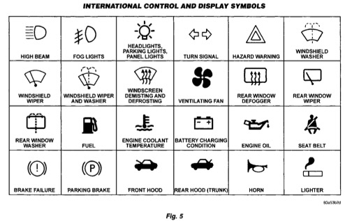

## GENERAL INFORMATION (Continued)

### INTERNATIONAL CONTROL AND DISPLAY SYMBOLS

*Fig. 5 Symbol Chart*

| Symbol | Description |
|--------|-------------|
| [icon] | HIGH BEAM |
| [icon] | FOG LIGHTS |
| [icon] | HEADLIGHTS, PARKING LIGHTS, PANEL LIGHTS |
| [icon] | TURN SIGNAL |
| [icon] | HAZARD WARNING |
| [icon] | WINDSHIELD WASHER |
| [icon] | WINDSHIELD WIPER |
| [icon] | WINDSHIELD WIPER AND WASHER |
| [icon] | DEMISTING AND DEFROSTING |
| [icon] | VENTILATING FAN |
| [icon] | REAR WINDOW DEFOGGER |
| [icon] | REAR WINDOW WIPER |
| [icon] | REAR WINDOW WASHER |
| [icon] | FUEL |
| [icon] | ENGINE COOLANT TEMPERATURE |
| [icon] | BATTERY CHARGING CONDITION |
| [icon] | ENGINE OIL |
| [icon] | SEAT BELT |
| [icon] | BRAKE FAILURE |
| [icon] | PARKING BRAKE |
| [icon] | FRONT HOOD |
| [icon] | REAR HOOD (TRUNK) |
| [icon] | HORN |
| [icon] | LIGHTER |

*Fig. 5*

### FASTENER IDENTIFICATION

#### THREAD IDENTIFICATION

SAE and metric bolt/nut threads are not the same. The difference is described in the Thread Notation chart (Fig. 6).

| SAE (Inch) | Metric |
|------------|--------|
| 5/16-18 | M8 X 1.25 |
| Major Diameter in Inches | Major Diameter in Millimeters |
| Number of Threads Per Inch | Distance Between Threads in Millimeters |

*Fig. 6 Thread Notation—SAE and Metric*

#### GRADE/CLASS IDENTIFICATION

The SAE bolt strength grades range from grade 2 to grade 8. The higher the grade number, the greater the bolt strength. Identification is determined by the line marks on the top of each bolt head. The actual bolt strength grade corresponds to the number of line marks plus 2. The most commonly used metric bolt strength classes are 9.8 and 12.9. The metric strength class identification number is imprinted on the head of the bolt. The higher the class number, the greater the bolt strength. Some metric nuts are imprinted with a single-digit strength class on the nut face. Refer to the Fastener Identification and Fastener Strength Charts.
