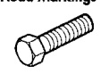

## GENERAL INFORMATION (Continued)

### FASTENER IDENTIFICATION

#### Bolt Markings and Torque - Metric

**Commercial Steel Class: 8.8, 10.9, 12.9**

| Body Size (mm) | 8.8 Cast Iron (N•m / ft-lb) | 8.8 Aluminum (N•m / ft-lb) | 10.9 Cast Iron (N•m / ft-lb) | 10.9 Aluminum (N•m / ft-lb) | 12.9 Cast Iron (N•m / ft-lb) | 12.9 Aluminum (N•m / ft-lb) |
|----------------|------------------------------|-----------------------------|-----------------------------|-----------------------------|-----------------------------|----------------------------|
| 6 | 9 / 5 | 7 / 4 | 14 / 9 | 11 / 7 | 14 / 9 | 11 / 7 |
| 7 | 14 / 9 | 11 / 7 | 18 / 14 | 14 / 11 | 23 / 18 | 18 / 14 |
| 8 | 25 / 18 | 18 / 14 | 32 / 23 | 25 / 18 | 36 / 27 | 28 / 21 |
| 10 | 40 / 30 | 30 / 25 | 60 / 45 | 45 / 35 | 70 / 50 | 55 / 40 |
| 12 | 70 / 55 | 55 / 40 | 105 / 75 | 80 / 60 | 125 / 95 | 100 / 75 |
| 14 | 115 / 85 | 90 / 65 | 160 / 120 | 125 / 95 | 195 / 145 | 150 / 110 |
| 16 | 180 / 130 | 140 / 100 | 240 / 175 | 190 / 135 | 290 / 210 | 220 / 165 |
| 18 | 230 / 170 | 180 / 135 | 320 / 240 | 250 / 185 | 400 / 290 | 310 / 230 |

#### Bolt Markings and Torque Values - U.S. Customary

**SAE Grade Number 5** - Bolt Head Markings: 3 radial lines
**SAE Grade Number 8** - Bolt Head Markings: 6 radial lines

*Fig. 2 Bolt Head Markings showing SAE Grade 5 (3 lines) and Grade 8 (6 lines)*

| Body Size | Grade 5 Cast Iron (N•m / ft-lb) | Grade 5 Aluminum (N•m / ft-lb) | Grade 8 Cast Iron (N•m / ft-lb) | Grade 8 Aluminum (N•m / ft-lb) |
|-----------|----------------------------------|--------------------------------|----------------------------------|--------------------------------|
| 1/4 - 20 | 9 / 7 | 8 / 6 | 15 / 11 | 12 / 9 |
| 1/4 - 28 | 12 / 9 | 9 / 7 | 18 / 13 | 14 / 10 |
| 5/16 - 18 | 20 / 15 | 16 / 12 | 30 / 22 | 25 / 19 |
| 5/16 - 24 | 23 / 17 | 19 / 14 | 33 / 24 | 24 / 18 |
| 3/8 - 16 | 40 / 30 | 25 / 20 | 55 / 40 | 45 / 35 |
| 3/8 - 24 | 40 / 30 | 35 / 25 | 60 / 45 | 45 / 35 |
| 7/16 - 14 | 60 / 45 | 45 / 35 | 90 / 65 | 65 / 50 |
| 7/16 - 20 | 65 / 50 | 55 / 40 | 95 / 70 | 75 / 55 |
| 1/2 - 13 | 95 / 70 | 75 / 55 | 130 / 95 | 100 / 75 |
| 1/2 - 20 | 100 / 75 | 80 / 60 | 150 / 110 | 120 / 90 |
| 9/16 - 12 | 135 / 100 | 110 / 80 | 190 / 140 | 150 / 110 |
| 9/16 - 18 | 150 / 110 | 115 / 85 | 210 / 155 | 170 / 125 |
| 5/8 - 11 | 180 / 135 | 150 / 110 | 255 / 190 | 205 / 150 |
| 5/8 - 18 | 210 / 155 | 160 / 120 | 290 / 215 | 230 / 170 |
| 3/4 - 10 | 325 / 240 | 255 / 190 | 460 / 340 | 365 / 270 |
| 3/4 - 16 | 365 / 270 | 285 / 210 | 515 / 380 | 410 / 300 |
| 7/8 - 9 | 490 / 360 | 380 / 280 | 745 / 550 | 600 / 440 |
| 7/8 - 14 | 530 / 390 | 420 / 310 | 825 / 610 | 660 / 490 |
| 1 - 8 | 720 / 530 | 570 / 420 | 1100 / 820 | 890 / 660 |
| 1 - 14 | 800 / 590 | 650 / 480 | 1200 / 890 | 960 / 710 |
