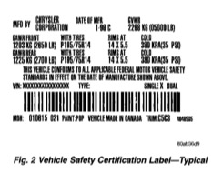
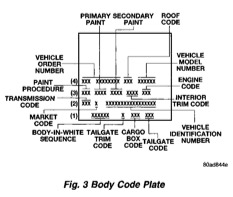

## GENERAL INFORMATION (Continued)

### VIN Decoding Chart

| Position | Interpretation | Code = Description |
|----------|----------------|-------------------|
| 1 | Country of Origin | 1 = United States |
|   |                   | 3 = Mexico |
| 2 | Make | B = Dodge |
| 3 | Vehicle Type | 4 = Multipurpose Passenger |
|   |              | 5 = Bus |
|   |              | 6 = Incomplete |
|   |              | 7 = Truck |
| 4 | Gross Vehicle Weight Rating | H = 6001-7000 |
|   |                             | J = 7001-8000 |
|   |                             | K = 8001-9000 |
|   |                             | L = 9001-10,000 |
|   |                             | M = 10,001-14,000 |
|   |                             | W = Hydraulic Brakes |
| 5 | Vehicle Line | C = Ram Cab Chassis/Ram Pick Up (4x2) |
|   |              | F = Ram Cab Chassis/Ram Pick Up (4x4) |
| 6 | Series | 1 = 1500 |
|   |        | 2 = 2500 |
|   |        | 3 = 3500 |
| 7 | Body Style | 2 = Club Cab |
|   |            | 3 = Quad Cab |
|   |            | 6 = Conventional Cab/Cab Chassis |
| 8 | Engine | D = 5.9L 6cyl. Diesel |
|   |        | W = 8.0L 10 cyl. MPI |
|   |        | X = 3.9L 6 cyl. MPI |
|   |        | Y = 5.2L 8 cyl. MPI |
|   |        | Z = 5.9L 8 cyl. MPI-LDC |
|   |        | 5 = 5.9L 8cyl. MPI-HDC |
| 9 | Check Digit |  |
| 10 | Model Year | W = 1998 |
| 11 | Plant Location | J = St. Louis North |
|    |                | S = Dodge City |
|    |                | G = Saltillo |
|    |                | M = Lago Alberto Assembly |
| 12 thru 17 | Vehicle Build Sequence |  |

*Fig. 2 Vehicle Safety Certification Label—Typical*

*Fig. 3 Body Code Plate*
