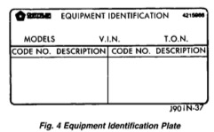

## GENERAL INFORMATION (Continued)

### BODY CODE PLATE—LINE 1 (Continued)

#### DIGIT 8
Tailgate trim code.

#### DIGIT 9
Open Space

#### DIGITS 10 THROUGH 12
Cargo box code

• XBS = Sweptline

#### DIGIT 13
Open Space

#### DIGITS 14 THROUGH 16
Tailgate code

• MWD = Plain Tailgate

### EQUIPMENT IDENTIFICATION PLATE

The Equipment Identification Plate (Fig. 4) is located at the left, front of the inner hood panel. The plate lists information concerning the vehicle as follows:

• The model.
• The wheelbase.
• The VIN (Vehicle Identification Number).
• The T.O.N. (order number).
• The optional and special equipment installed on the vehicle.

Refer to the information listed on the plate when ordering replacement parts.

*Fig. 4 Equipment Identification Plate*

### VEHICLE DIMENSIONS

The Vehicle Dimensions chart provides the dimensions for each type of Ram Truck. To determine model designation, refer to line 4 of the Body Code Plate.

#### EXTERIOR DIMENSIONS

**MODEL: BR1L31**
| Dimension | Measurement |
|-----------|-------------|
| Wheel Base | 138.2 in. (3509.2 mm) |
| Track: Front | 63.0 in. (1600.1 mm) |
| Track: Rear | 66.9 in. (1699.3 mm) |
| Length | 204.1 in. (5183.7 mm) |
| Width | 79.3 in. (2013.2 mm) |
| Height | 73.1 in. (1855.8 mm) |

**MODEL: BE1L32**
| Dimension | Measurement |
|-----------|-------------|
| Wheel Base | 154.7 in. (3929.5 mm) |
| Track: Front | 63.0 in. (1600.1 mm) |
| Track: Rear | 66.9 in. (1699.3 mm) |
| Length | 224.3 in. (5697.7 mm) |
| Width | 79.3 in. (2013.2 mm) |
| Height | 73.1 in. (1856.5 mm) |

**MODEL: BE1L33**
| Dimension | Measurement |
|-----------|-------------|
| Wheel Base | 138.6 in. (3519.5 mm) |
| Track: Front | 63.0 in. (1600.1 mm) |
| Track: Rear | 66.9 in. (1699.3 mm) |
| Length | 213.4 in. (5420.6 mm) |
| Width | 79.3 in. (2013.2 mm) |
| Height | 73.1 in. (1856.5 mm) |

**MODEL: BE1L34**
| Dimension | Measurement |
|-----------|-------------|
| Wheel Base | 154.7 in. (3929.5 mm) |
| Track: Front | 63.0 in. (1600.1 mm) |
| Track: Rear | 66.9 in. (1699.3 mm) |
| Length | 229.6 in. (5831.9 mm) |
| Width | 79.3 in. (2013.2 mm) |
| Height | 73.1 in. (1856.5 mm) |

**MODEL: BR1L61**
| Dimension | Measurement |
|-----------|-------------|
| Wheel Base | 118.7 in. (3015.0 mm) |
| Track: Front | 63.0 in. (1600.1 mm) |
| Track: Rear | 66.9 in. (1699.3 mm) |
| Length | 194.3 in. (4934.7 mm) |
| Width | 79.3 in. (2013.2 mm) |
| Height | 71.7 in. (1820.7 mm) |

**MODEL: BR1L62**
| Dimension | Measurement |
|-----------|-------------|
| Wheel Base | 134.7 in. (3421.5 mm) |
| Track: Front | 63.0 in. (1600.1 mm) |
| Track: Rear | 66.9 in. (1699.3 mm) |
| Length | 210.4 in. (5343.1 mm) |
| Width | 79.3 in. (2013.2 mm) |
| Height | 71.7 in. (1820.7 mm) |

**MODEL: BE6L31**
| Dimension | Measurement |
|-----------|-------------|
| Wheel Base | 138.6 in. (3519.5 mm) |
| Track: Front | 64.0 in. (1625.5 mm) |
| Track: Rear | 66.9 in. (1699.3 mm) |
| Length | 213.4 in. (5420.6 mm) |
| Width | 79.3 in. (2013.2 mm) |
| Height | 74.7 in. (1898.6 mm) |

**MODEL: BE6L32**
| Dimension | Measurement |
|-----------|-------------|
| Wheel Base | 154.7 in. (3929.5 mm) |
| Track: Front | 64.0 in. (1625.5 mm) |
| Track: Rear | 66.9 in. (1699.3 mm) |
| Length | 229.6 in. (5831.9 mm) |
| Width | 79.3 in. (2013.2 mm) |
| Height | 74.7 in. (1898.6 mm) |
