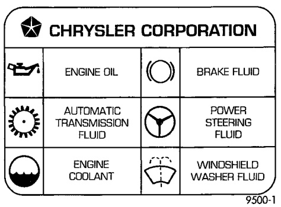

# LUBRICATION AND MAINTENANCE

## CONTENTS

| Topic | Page |
|-------|------|
| GENERAL INFORMATION | 1 |
| JUMP STARTING, TOWING AND HOISTING | 24 |
| MAINTENANCE SCHEDULES—DIESEL ENGINE VEHICLES | 14 |
| MAINTENANCE SCHEDULES—HEAVY DUTY VEHICLES | 14 |
| MAINTENANCE SCHEDULES—LIGHT DUTY VEHICLES | 4 |
| MAINTENANCE SCHEDULES—MEDIUM DUTY VEHICLES | 9 |

## GENERAL INFORMATION

### INDEX

| Topic | Page |
|-------|------|
| INTRODUCTION | 1 |
| CLASSIFICATION OF LUBRICANTS | 2 |
| PARTS AND LUBRICANT RECOMMENDATIONS | 1 |
| FLUID CAPACITIES | 3 |
| INTERNATIONAL SYMBOLS | 1 |

### INTRODUCTION

Service and maintenance procedures for components and systems listed in Schedule - A or B can be found by using the Group Tab Locator index at the front of this manual. If it is not clear which group contains the information needed, refer to the index at the back of this manual.

There are two maintenance schedules that show proper service based on the conditions that the vehicle is subjected to.

**Schedule - A**, lists scheduled maintenance to be performed when the vehicle is used for general transportation.

**Schedule - B**, lists maintenance intervals for vehicles that are operated under the conditions listed at the beginning of the Maintenance Schedule section.

Use the schedule that best describes your driving conditions.

Where time and mileage are listed, follow the interval that occurs first.

### PARTS AND LUBRICANT RECOMMENDATIONS

When service is required, Chrysler Corporation recommends that only Mopar® brand parts, lubricants and chemicals be used. Mopar provides the best engineered products for servicing Chrysler Corporation vehicles.

### INTERNATIONAL SYMBOLS

Chrysler Corporation uses international symbols to identify engine compartment lubricant and fluid inspection and fill locations (Fig. 1).

*Fig. 1 International Symbols*
