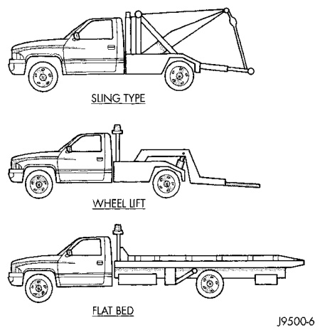
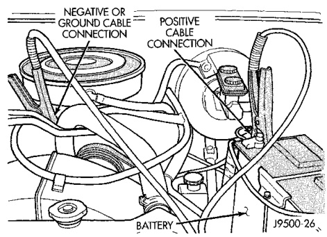
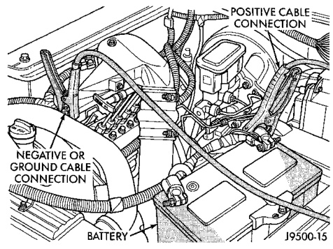

## SERVICE PROCEDURES (Continued)

*Fig. 2 Jumper Cable Clamp Connections—Gas Engine*
- Discharged Battery
- Booster Battery
- Engine Ground

*Fig. 1 Jumper Cable Clamp Connections—Diesel Engine*
- Discharged Battery
- Booster Battery
- Engine Ground

When towing a 4WD vehicle using a wheel-lift towing device, use tow dollies under the opposite end of the vehicle. A vehicle with flat-bed device can also be used to transport a disabled vehicle (Fig. 3).

A wooden crossbeam may be required for proper connection when using the sling-type, front-end towing method.

## SAFETY PRECAUTIONS

**CAUTION: The following safety precautions must be observed when towing a vehicle:**

• Secure loose and protruding parts.

• Always use a safety chain system that is independent of the lifting and towing equipment.

• Do not allow towing equipment to contact the disabled vehicle's fuel tank.

• Do not allow anyone under the disabled vehicle while it is lifted by the towing device.

*Fig. 3 Tow Vehicles With Approved Equipment*
- Wheel-Lift Device
- Flat-Bed Device
- Tow Dollies

• Do not allow passengers to ride in a vehicle being towed.

• Always observe state and local laws regarding towing regulations.

• Do not tow a vehicle in a manner that could jeopardize the safety of the operator, pedestrians or other motorists.

• Do not attach tow chains, T-hooks, J-hooks, or a tow sling to a bumper, steering linkage, drive shafts or a non-reinforced frame hole.

• Do not tow a heavily loaded vehicle. Damage to the cab, cargo box or frame may result. Use a flatbed device to transport a loaded vehicle.

## GROUND CLEARANCE

**CAUTION:** If vehicle is towed with wheels removed, install lug nuts to retain brake drums or rotors.

A towed vehicle should be raised until lifted wheels are a minimum 100 mm (4 in) from the ground. Be sure there is adequate ground clearance at the opposite end of the vehicle, especially when towing over rough terrain or steep rises in the road. If necessary, remove the wheels from the lifted end of the vehicle and lower the vehicle closer to the ground, to increase the ground clearance at the opposite end of the vehicle. Install lug nuts on wheel attaching studs to retain brake drums or rotors.
