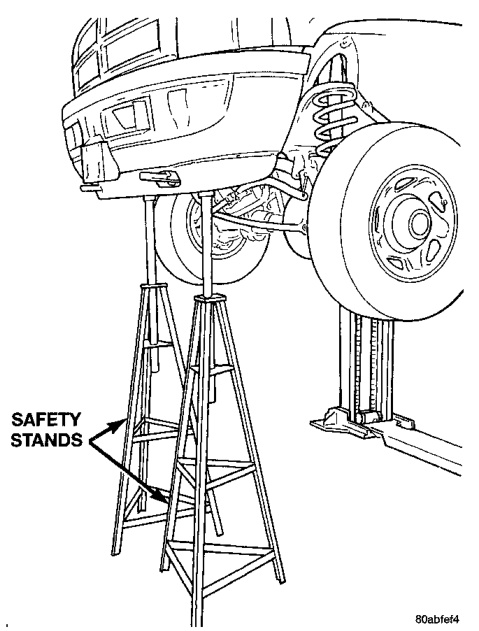
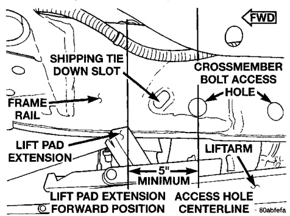
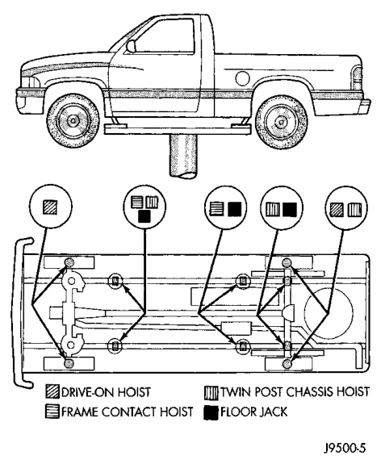

## SERVICE PROCEDURES (Continued)

*Fig. 4 Safety Stands*
- Safety Stand
- Frame Rail

**NOTE:** Use the correct frame rail lifting locations only (Fig. 5).

### HOIST

A vehicle can be lifted with:

• A single-post, frame-contact hoist.

• A twin-post, chassis hoist.

• A ramp-type, drive-on hoist.

**NOTE:** When a frame-contact type hoist is used, verify that the lifting pads are positioned properly (Fig. 5). The forward lifting pads should be positioned a minimum of 5 inches forward of the crossmember bolt access holes (Fig. 6).

*Fig. 6 Vehicle Lifting Locations*
- Front Lift Points
- Rear Lift Points
- Frame Rails

*Fig. 5 Front Lift Pad Location*
- Minimum 5 inches forward
- Crossmember Bolt Access Holes
