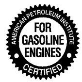
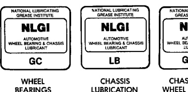

## GENERAL INFORMATION (Continued)

### CLASSIFICATION OF LUBRICANTS

Only lubricants that are endorsed by the following organization should be used to service a Chrysler Corporation vehicle.

• Society of Automotive Engineers (SAE)

• American Petroleum Institute (API) (Fig. 2)

• National Lubricating Grease Institute (NLGI) (Fig. 3)

*Fig. 2 API Symbol*

### GASOLINE ENGINE OIL

#### SAE VISCOSITY RATING INDICATES ENGINE OIL VISCOSITY

An SAE viscosity grade is used to specify the viscosity of engine oil. SAE 30 specifies a single viscosity engine oil. Engine oils also have multiple viscosities. These are specified with a dual SAE viscosity grade which indicates the cold-to-hot temperature viscosity range.

• SAE 30 = single grade engine oil.

• SAE 10W-30 = multiple grade engine oil.

#### API QUALITY CLASSIFICATION

The API Service Grade specifies the type of performance the engine oil is intended to provide. The API Service Grade specifications also apply to energy conserving engine oils.

Use engine oils that are API Service Certified. 5W-30 and 10W-30 MOPAR engine oils conform to specifications.

Refer to Group 9, Engine for gasoline engine oil specification.

### DIESEL ENGINE OIL

#### ENGINE OIL QUALITY

Use only oils conforming to API Quality CE, or CE/SG. A sulfated ash limit is specified for lubrication oil used in Cummins engines. Oils with a high ash content may produce deposits on valves that can progress to guttering and valve burning. A maximum sulfated ash content of 1.85 mass % is recommended for all oil used in the engine.

Refer to Group 9, Engine for diesel engine oil specification.

### GEAR LUBRICANTS

SAE ratings also apply to multiple grade gear lubricants. In addition, API classification defines the lubricants usage.

### LUBRICANTS AND GREASES

Lubricating grease is rated for quality and usage by the NLGI. All approved products have the NLGI symbol (Fig. 3) on the label. At the bottom NLGI symbol is the usage and quality identification letters. Wheel bearing lubricant is identified by the letter "G". Chassis lubricant is identified by the letter "L". The letter following the usage letter indicates the quality of the lubricant. The following symbols indicate the highest quality.

*Fig. 3 NLGI Symbol*

### FLUID CAPACITIES

#### FUEL TANK

| Configuration | Capacity |
|---------------|----------|
| 119 inch wheel base | 26 L (26 qts.) |
| 135 inch wheel base | 98 L (26 qts.) |
| All others | 128 L (34 qts.) |

#### ENGINE OIL W/FILTER CHANGE

| Engine | Capacity |
|--------|----------|
| 3.9L | 4.7 L (5 qts.) |
| 5.2L & 5.9L Gasoline | 4.7 L (5 qts.) |
| 5.9L Diesel | 10.4 L (11 qts.) |
| 8.0L | 6.6 L (7 qts.) |

#### ENGINE OIL W/O FILTER CHANGE

| Engine | Capacity |
|--------|----------|
| 3.9L | 4.3 L (4.5 qts.) |
| 5.2L & 5.9L Gasoline | 4.3 L (4.5 qts.) |
| 5.9L Diesel* | 9.5 L (10 qts.) |
| 8.0L* | 5.7 L (6 qts.) |

*Oil filter must be changed with every oil change.

#### COOLING SYSTEM

| Engine | Capacity |
|--------|----------|
| 3.9L | 14.2 L (15 qts.) |
| 5.2L | 19 L (20 qts.) |
| 5.9L Gas | 20.8 L (22 qts.) |
| 5.9L Diesel | 23.5 L (24.8 qts.) |
| 8.0L | 25.5 L (28 qts.) |
