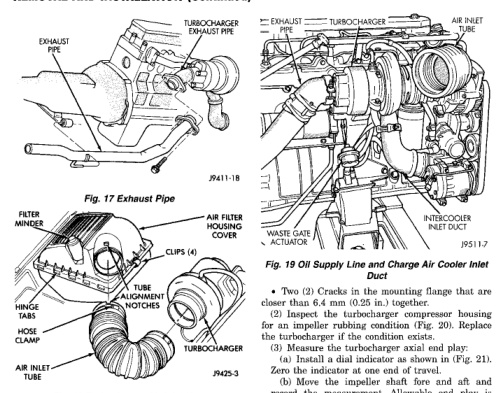

## REMOVAL AND INSTALLATION (Continued)

*Fig. 20 Exhaust Pipe]*

*Fig. 20 Turbocharger Air Inlet Hose*

**CAUTION: The turbocharger is only serviced as an assembly. Do not attempt to repair the turbocharger as turbocharger and/or engine damage can result.**

### CLEANING

Clean the turbocharger and exhaust manifold mounting surfaces with a suitable scraper.

### INSPECTION

Visually inspect the turbocharger and exhaust manifold gasket surfaces. Replace stripped or eroded mounting studs.

(1) Visually inspect the turbocharger for cracks. The following cracks are NOT acceptable:
- Cracks in the turbine and compressor housing that go completely through.
- Cracks in the mounting flange that are longer than 15 mm (0.6 in.).
- Cracks in the mounting flange that intersect bolt through-holes.

*Fig. 21 Oil Supply Line and Charge Air Cooler Inlet*

- Two (2) Cracks in the mounting flange that are closer than 6.4 mm (0.25 in.) together.

(2) Inspect the turbocharger compressor housing for an impeller rubbing condition (Fig. 20). Replace the turbocharger if the condition exists.

(3) Measure the turbocharger axial end play:

(a) Install a dial indicator as shown in (Fig. 21). Zero the indicator at one end of travel.

(b) Move the impeller shaft fore and aft and record the measurement. Allowable end play is 0.038 mm (0.0015 in.) MIN. and 0.089 mm (0.0035 in.) MAX. If the recorded measurement falls outside these parameters, replace the turbocharger assembly.

(4) Measure the turbocharger bearing radial clearance:

(a) Insert a narrow blade or wire style feeler gauge between the compressor wheel and the housing (Fig. 22).

(b) Gently push the compressor wheel toward the housing and record the clearance.

(c) With the feeler gauge in the same location, gently push the compressor wheel away from the housing and again record the clearance.

(d) Subtract the smaller clearance from the larger clearance. This is the radial bearing clearance.

(e) Allowable radial bearing clearance is 0.326 mm (0.0128 in.) MIN. and 0.496 mm (0.0195 in.) MAX. If the recorded measurement falls outside these specifications, replace the turbocharger assy.