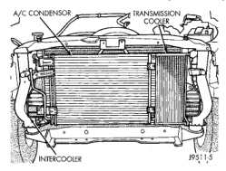
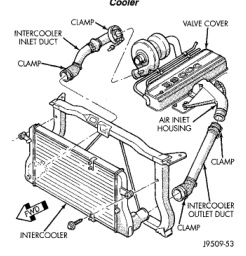

# BR — EXHAUST SYSTEM AND TURBOCHARGER 11 - 13

## REMOVAL AND INSTALLATION (Continued)

*Fig. 23 Condenser and Transmission Auxiliary Cooler]*
- A/C CONDENSER
- TRANSMISSION COOLER
- INTERCOOLER

*Fig. 2 Air Intake System Tubes]*
- CLAMP
- INTERCOOLER INLET DUCT
- HUMP COVER
- AIR INLET HOUSING
- CLAMP
- INTERCOOLER OUTLET DUCT
- CLAMP

**CAUTION: Do not use caustic cleaners to clean the charge air cooler. Damage to the charge air cooler will result.**

(2) Position the charge air cooler so the inlet and outlet tubes are vertical.

(3) Flush the cooler internally with solvent in the direction opposite of normal air flow.

(4) Shake the cooler and lightly tap on the end tanks with a rubber mallet to dislodge trapped debris.

(5) Continue flushing until all debris or oil are removed.

(6) Rinse the cooler with hot soapy water to remove any remaining solvent.

(7) Rinse thoroughly with clean water and blow dry with compressed air.

### INSPECTION

Visually inspect the charge air cooler for cracks, holes, or damage. Inspect the tubes, fins, and welds for tears, breaks, or other damage. Replace the charge air cooler if damage is found.

Pressure test the charge air cooler, using Charge Air Cooler Tester Kit #3824556. This kit is available through Cummins® Service Products. Instructions are provided with the kit.

### INSTALLATION

(1) Position the charge air cooler. Install the bolts and tighten to 2 N·m (17 in. lbs.) torque.

(2) Install the air intake system tubes to the charge air cooler. With the clamps in position, tighten the clamps to 8 N·m (72 in. lbs.) torque.

(3) Install the transmission auxiliary cooler (if equipped). Refer to Group 7, Cooling for the correct procedures.

(4) Install the A/C condenser (if A/C equipped). Refer to Group 24, Heating and Air Conditioning for the correct procedures.

(5) Install the front support bracket. Install and tighten the bolts.

(6) Install the front bumper. Refer to Group 13, Frame and Bumpers for the correct procedures.

(7) Connect the battery negative cables.

(8) Start engine and check for boost system leaks.

## CLEANING AND INSPECTION

### CHARGE AIR COOLER

#### CLEANING

(1) If the engine experiences a turbocharger failure or any other situation where oil or debris get into the charge air cooler, the charge air cooler must be cleaned internally.

**CAUTION: Do not use caustic cleaners to clean the charge air cooler. Damage to the charge air cooler will result.**

**NOTE: If internal debris cannot be removed from the cooler, the charge air cooler MUST be replaced.**

(2) Position the charge air cooler so the inlet and outlet tubes are vertical.

(3) Flush the cooler internally with solvent in the direction opposite of normal air flow.

(4) Shake the cooler and lightly tap on the end tanks with a rubber mallet to dislodge trapped debris.

(5) Continue flushing until all debris or oil are removed.