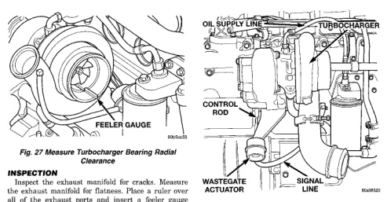
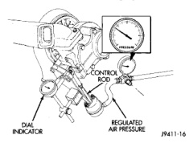

# CLEANING AND INSPECTION (Continued)

*Fig. 27 Measure Turbocharger Bearing Radial Clearance]*
- FEELER GAUGE
- OIL SUPPLY LINE
- TURBOCHARGER
- CONTROL ROD
- WASTEGATE ACTUATOR
- SIGNAL LINE

## INSPECTION

Inspect the exhaust manifold for cracks. Measure the exhaust manifold for flatness. Place a ruler over all of the exhaust ports and insert a feeler gauge between the port flange and the ruler. Replace any manifold that is cracked or warped.

**EXHAUST MANIFOLD FLATNESS**

| Specification | Value |
|--------------|-------|
| Maximum | 0.20 mm (0.008 in.) |

# ADJUSTMENTS

## WASTEGATE ADJUSTMENT

The wastegate turbocharger provides additional low speed boost without over-boost at high speeds. This increases low speed torque and better driveability.

Proper adjustment of the wastegate assembly is critical to the operation of the wastegate turbocharger (Fig. 28). The control rod is set at the factory and no adjustment should be necessary, unless wastegate assembly is damaged.

**CAUTION: DO NOT adjust the wastegate so that higher pressures are required to open the wastegate valve. The turbocharger speed will be increased and can cause damage to the turbocharger and cause a loss of engine performance.**

(1) Remove signal line from wastegate actuator. The signal line may be installed with tamperproof clamps. These can be discarded and replaced with standard worm-gear clamps.

(2) Connect regulated air pressure to the wastegate actuator (Fig. 29). Install a dial indicator to measure the control rod movement. Apply 103 - 138 kPa (15 - 20 psi) to seat the components and take

*Fig. 28 Wastegate Turbocharger]*

any slack out of the control rod. Release the air pressure and zero the dial indicator gauge.

*Fig. 27 Wastegate and Dial Indicator]*
- DIAL INDICATOR
- REGULATED AIR PRESSURE

(3) Apply 144.8 kPa (21 psi) air pressure to the actuator. The control rod should move 0.33 - 1.27 mm (0.013 - 0.050 in) total travel. If the rod travel is out of limits, the wastegate linkage must be adjusted.

(4) To adjust the wastegate linkage, apply air pressure to the actuator to release the spring tension on the lever. Remove the control rod from the wastegate lever (Fig. 30). Pull the wastegate lever toward the actuator (closed position).

(5) Adjust the length of the clevis end of the control rod to align the clevis pin hole to the wastegate lever. Install the adjusting link and retaining clip (Fig. 30).