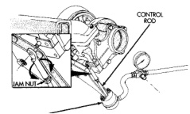

# ADJUSTMENTS (Continued)

**CAUTION: DO NOT pull, push or force the alignment of the clevis pin.**

(6) After the adjustment is complete, tighten the actuator rod jam nut.

(7) Recheck the travel on the wastegate control rod. Adjust, if necessary.

*Fig. 30 Adjustment of Wastegate Actuator]*
- CONTROL ROD
- JAM NUT
- WASTEGATE ACTUATOR

# SPECIFICATIONS

## TORQUE SPECIFICATIONS

| DESCRIPTION | TORQUE |
|-------------|--------|
| **Air Grid Heater Power Supply** | |
| Nuts | 34 N·m (24 ft. lbs.) |
| **Air Inlet Housing** | |
| Bolts | 24 N·m (18 ft. lbs.) |
| **Charge Air Cooler/Boost System Pipes** | |
| Clamps | 8 N·m (72 in. lbs.) |
| **Charge Air Cooler Mounting** | |
| Bolts | 2 N·m (17 in. lbs.) |
| **Exhaust Clamps (All)** | |
| Nuts | 44 N·m (32 ft. lbs.) |
| **Exhaust Manifold to Cylinder Head** | |
| Bolts | 34 N·m (25 ft. lbs.) |
| **Exhaust Pipe to Manifold** | |
| Bolts | 34 N·m (25 ft. lbs.) |
| **Intake Manifold Cover** | |
| Bolts | 24 N·m (18 ft. lbs.) |
| **Turbocharger-to-Exhaust Manifold** | |
| Nuts | 32 N·m (24 ft. lbs.) |
| **Turbocharger Oil Drain Tube** | |
| Bolts | 24 N·m (18 ft. lbs.) |
| **Turbocharger Oil Supply Line** | |
| Fitting | 15 N·m (133 in. lbs.) |
| **Turbocharger V-Band Clamp** | |
| Nut | 9 N·m (79 in. lbs.) |