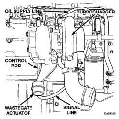
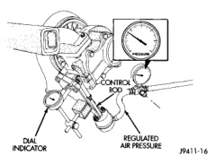
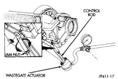

# EXHAUST SYSTEM AND INTAKE MANIFOLD

## REMOVAL AND INSTALLATION (Continued)

Proper adjustment of the wastegate assembly is critical to the operation of the wastegate turbocharger (Fig. 38). The control rod is set at the factory and no adjustment should be necessary, unless wastegate assembly is damaged.

*Fig. 38 Wastegate Turbocharger]*(page_17_fig_38.jpg)

**CAUTION: DO NOT adjust the wastegate so that higher pressures are required to open the wastegate valve. The turbocharger speed will be increased and can cause damage to the turbocharger and cause a loss of engine performance.**

(1) Disconnect signal line from wastegate actuator. The signal line may be installed with tamper-proof clamps. **These can be discarded and replaced with standard worm-gear clamps.**

(2) Connect regulated air pressure to the wastegate actuator (Fig. 39). Install a dial indicator to measure the control rod movement. Apply 103 - 138 kPa (15 - 20 psi) to seat the components and take any slack out of the control rod. Release the air pressure and zero the dial indicator gauge.

(3) Apply 193 kPa (28 psi) air pressure to the actuator. The control rod should move 0.33 - 1.33 mm (0.013 - 0.052 in) total travel. If the rod travel is out of limits, the wastegate linkage must be adjusted.

(4) To adjust the wastegate linkage, apply air pressure to the actuator to release the spring tension on the lever. Remove the control rod from the wastegate lever (Fig. 40). Pull the wastegate lever toward the actuator (closed position).

(5) Adjust the length of the clevis end of the control rod to align the clevis pin hole to the wastegate lever. Install the adjusting link and retaining clip (Fig. 40).

*Fig. 39 Wastegate and Dial Indicator]*(page_17_fig_39.jpg)

**CAUTION: DO NOT pull, push or force the alignment of the clevis pin.**

(6) After the adjustment is complete, tighten the actuator rod jam nut.

(7) Recheck the travel on the wastegate control rod. Adjust, if necessary.

*Fig. 40 Adjustment of Wastegate Actuator]*(page_17_fig_40.jpg)

## CHARGE AIR COOLER - DIESEL

### REMOVAL

**WARNING: IF THE ENGINE WAS JUST TURNED OFF, THE INTAKE AND OUTLET DUCTS MAY BE HOT.**

(1) Remove the front bumper (refer to Group 23, Body for the proper procedure).

(2) Remove the front support bracket (Fig. 41).

(3) If the vehicle is equipped with air conditioning, remove the condenser as follows:

*Source: 11 Exhaust System and Intake Manifold, Page 17*
