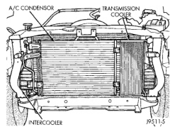
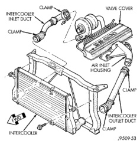

# EXHAUST SYSTEM AND INTAKE MANIFOLD

## REMOVAL AND INSTALLATION (Continued)

(a) Discharge the air conditioning system (refer to Group 24, Heating and Air Conditioning for the proper procedures).

(b) Remove the bolt from the sealing plate.

(c) Remove the nuts holding the condenser to the charge air cooler. Lift the condenser and sealing plate assembly away from the charge air cooler.

*Fig. 41 Condenser and Charge Air Cooler - Intercooler]*(page_18_fig_41.jpg)

(4) Remove the inlet and outlet ducts from the charge air cooler (Fig. 42).

(5) Remove the charge air cooler bolts. Pivot the charge air cooler forward and up to remove.

*Fig. 42 Charge Air Cooler Intercooler Ducts]*(page_18_fig_42.jpg)

### INSTALLATION

(1) Position the charge air cooler. Install the bolts and tighten to 2 N-m (17 in. lbs.) torque.

(2) Install the inlet and outlet ducts to the charge air cooler. With the clamps in position, tighten the clamp nut to 8 N-m (72 in. lbs.) torque.

(3) If the vehicle is equipped with air conditioning, install the condenser as follows:

(a) Position the condenser and sealing plate assembly onto the charge air cooler studs. Install the nuts and tighten.

(b) Connect the halves of the sealing plate. Install the bolt and tighten.

(c) Charge the air conditioning system (refer to Group 24, Heating and Air Conditioning for the proper procedures).

(4) Install the front support bracket. Install and tighten the bolts.

(5) Install the front bumper (refer to Group 23, Body for the proper procedure).

## CLEANING AND INSPECTION

### EXHAUST PIPE

**INSPECTION**

Discard rusted clamps, broken or worn supports and attaching parts. Replace a component with original equipment parts, or equivalent. This will assure proper alignment with other parts in the system and provide acceptable exhaust noise levels.

**CLEANING**

Clean ends of pipes to assure mating of all parts.

### INTAKE MANIFOLD

**CLEANING INTAKE**

Clean manifold in solvent and blow dry with compressed air.

Clean cylinder block front and rear gasket surfaces using a suitable solvent.

The plenum pan rail must be clean and dry (free of all foreign material).

**INSPECTION**

Inspect manifold for cracks.

Inspect mating surfaces of manifold for flatness with a straightedge.

### EXHAUST MANIFOLD

**CLEANING**

Clean mating surfaces on cylinder head and manifold. Wash with solvent and blow dry with compressed air.

*Source: 11 Exhaust System and Intake Manifold, Page 18*
