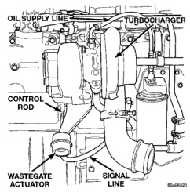

# EXHAUST SYSTEM AND INTAKE MANIFOLD

## CLEANING AND INSPECTION (Continued)

### EXHAUST MANIFOLD (Continued)

**INSPECTION**

Inspect manifold for cracks.

Inspect mating surfaces of manifold for flatness with a straight edge. Gasket surfaces must be flat within 0.2 mm per 300 mm (0.008 inch per foot).

### CHARGE AIR COOLER

**CLEANING**

If the engine experiences a turbocharger failure or any other occasion where oil or debris is put into the charge air cooler, the charge air cooler must be cleaned.

(1) Remove the charge air cooler from the vehicle, refer Charge Air Cooler in this section.

(2) Flush the charge air cooler internally with a non caustic solvent in the opposite direction of normal air flow. Shake the charge air cooler and LIGHTLY tap on the end tanks with a rubber mallet to dislodge trapped debris. Continue flushing until all debris or oil is removed.

(3) Use a flashlight and mirror to visually inspect the charge air cooler for internal debris.

**CAUTION: If internal debris cannot be removed, scrap the charge air cooler. DO NOT USE CAUSTIC CLEANERS TO CLEAN THE CHARGE AIR COOLER. DAMAGE TO THE CHARGE AIR COOLER WILL RESULT.**

(4) After the charge air cooler has been thoroughly cleaned of all oil and debris with the non caustic solvent, wash the charge air cooler internally with hot soapy water to remove the remaining solvent.

(5) Rinse thoroughly with clean water.

(6) Blow compressed air into the charge air cooler in the opposite direction of normal air flow until the charge air cooler is dry internally.

**INSPECTION**

(1) Visually inspect the charge air cooler.

(2) Inspect the tubes, fins and welds for tears, breaks or other damage. If any damage causes the charge air cooler to fail, the charge air cooler must be replaced.

### CATALYTIC CONVERTER

**INSPECTION**

Look at the stainless steel body of the converter, inspect for bulging or other distortion that could be a result of overheating. If the converter has a heat shield attached make sure it is not bent or loose.

**WARNING: UNLEADED FUEL MUST BE USED TO PREVENT BLOCKAGE OR CONTAMINATION TO THE CATALYST CORE.**

If you suspect internal damage to the catalyst, tapping the bottom of the catalyst with a rubber mallet may indicate a damaged core.

**CLEANING**

Clean ends of pipes and muffler to assure a good seal at mating surfaces.

## ADJUSTMENTS

### WASTEGATE ADJUSTMENT

The wastegate turbocharger provides additional low speed boost without over-boost at high speeds. This increases low speed torque and better driveability.

Proper adjustment of the wastegate assembly is critical to the operation of the wastegate turbocharger (Fig. 43). The control rod is set at the factory and no adjustment should be necessary, unless wastegate assembly is damaged.

*Fig. 43 Wastegate Turbocharger]*(page_19_fig_43.jpg)

**CAUTION: DO NOT adjust the wastegate so that higher pressures are required to open the wastegate valve. The turbocharger speed will be increased and can cause damage to the turbocharger and cause a loss of engine performance.**

(1) Remove signal line from wastegate actuator. The signal line may be installed with tamper-proof clamps. **These can be discarded and replaced with standard worm-gear clamps.**

(2) Connect regulated air pressure to the wastegate actuator (Fig. 44). Install a dial indicator to

*Source: 11 Exhaust System and Intake Manifold, Page 19*
