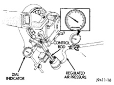
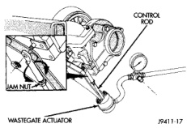

# EXHAUST SYSTEM AND INTAKE MANIFOLD

## ADJUSTMENTS (Continued)

measure the control rod movement. Apply 103 - 138 kPa (15 - 20 psi) to seat the components and take any slack out of the control rod. Release the air pressure and zero the dial indicator gauge.

*Fig. 45 Wastegate and Dial Indicator]*(page_20_fig_45.jpg)

(3) Apply 193 kPa (28 psi) air pressure to the actuator. The control rod should move 0.33 - 1.33 mm (0.013 - 0.052 in) total travel. If the rod travel is out of limits, the wastegate linkage must be adjusted.

(4) To adjust the wastegate linkage, apply air pressure to the actuator to release the spring tension on the lever. Remove the control rod from the wastegate lever (Fig. 45). Pull the wastegate lever toward the actuator (closed position).

(5) Adjust the length of the clevis end of the control rod to align the clevis pin hole to the wastegate lever. Install the adjusting link and retaining clip (Fig. 45).

**CAUTION: DO NOT pull, push or force the alignment of the clevis pin.**

(6) After the adjustment is complete, tighten the actuator rod jam nut.

(7) Recheck the travel on the wastegate control rod. Adjust, if necessary.

*Fig. 46 Adjustment of Wastegate Actuator]*(page_20_fig_46.jpg)

*Source: 11 Exhaust System and Intake Manifold, Page 20*
