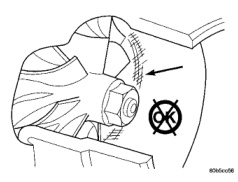

## REMOVAL AND INSTALLATION (Continued)

*Fig. 20 Inspect Compressor Housing for Impeller Rubbing Condition]*

*Fig. 21 Measure Turbocharger Axial End Play*

*Fig. 22 Measure Turbocharger Bearing Radial Clearance*

### INSTALLATION

(1) Install the turbocharger. Apply anti-seize to the studs and then tighten the turbocharger mounting nuts to 32 N·m (24 ft·lbs.) torque.

(2) Install the oil drain tube and oil supply line to the turbocharger (Fig. 19). Tighten the drain tube bolts to 24 N·m (18 ft·lbs.) torque.

(3) Pre-lube the turbocharger. Pour 50 to 60 cc (2 to 3 oz.) clean engine oil in the oil supply line fitting. Carefully rotate the turbocharger impeller by hand to distribute the oil thoroughly.

(4) Install and tighten the oil supply line fitting nut to 20 N·m (133 in·lbs.) torque.

(5) Position the charge air cooler inlet pipe to the turbocharger. With the clamp in position, tighten the clamp nut to 8 N·m (72 in·lbs.) torque.

(6) Position the air inlet hose to the turbocharger (Fig. 18). Tighten the clamp to 8 N·m (72 in·lbs.) torque.

(7) Raise vehicle on hoist.

(8) Connect the exhaust pipe to the turbocharger (Fig. 17) and tighten the bolts to 34 N·m (25 ft·lbs.) torque.

(9) Lower the vehicle.

(10) Connect the battery negative cables.

(11) Start the engine to check for leaks.

## CHARGE AIR COOLER

### REMOVAL

**WARNING: IF THE ENGINE WAS JUST TURNED OFF, THE AIR INTAKE SYSTEM TUBES MAY BE HOT.**

(1) Disconnect the battery negative cables.

(2) Remove the front bumper. Refer to Group 13, Frame and Bumper for the correct procedure.

(3) Remove the front support bracket.

(4) Discharge the A/C system and remove the A/C condenser (Fig. 23) (if A/C equipped). Refer to Group 24, Heating and Air Conditioning for the correct procedures.

(5) Remove the transmission auxiliary cooler (Fig. 23) (if equipped). Refer to Group 7, Cooling System for the correct procedure.

(6) Remove the boost tubes from the charge air cooler (Fig. 24).

(7) Remove the charge air cooler bolts. Pivot the charge air cooler forward and up to remove.

### CLEANING

(1) If the engine experiences a turbocharger failure or any other situation where oil or debris get into the charge air cooler, the charge air cooler must be cleaned internally.