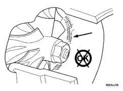
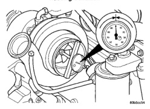

# 11 - 14 EXHAUST SYSTEM AND TURBOCHARGER — BR

## CLEANING AND INSPECTION (Continued)

(6) Rinse the cooler with hot soapy water to remove any remaining solvent.

(7) Rinse thoroughly with clean water and blow dry with compressed air.

#### INSPECTION

Visually inspect the charge air cooler for cracks, holes, or damage. Inspect the tubes, fins, and welds for tears, breaks, or other damage. Replace the charge air cooler if damage is found.

Pressure test the charge air cooler, using Charge Air Cooler Tester Kit #3824556. This kit is available through Cummins® Service Products. Instructions are provided with the kit.

### TURBOCHARGER

#### CLEANING

Clean the turbocharger and exhaust manifold mounting surfaces with a suitable scraper.

#### INSPECTION

Visually inspect the turbocharger and exhaust manifold gasket surfaces. Replace stripped or eroded mounting studs.

(1) Visually inspect the turbocharger for cracks. The following cracks are NOT acceptable:

- Cracks in the turbine and compressor housing that go completely through.
- Cracks in the mounting flange that are longer than 15 mm (0.6 in.).
- Cracks in the mounting flange that intersect bolt through-holes.
- Two (2) Cracks in the mounting flange that are closer than 6.4 mm (0.25 in.) together.

(2) Visually inspect the impeller and compressor wheel fins for nicks, cracks, or chips. Note: Some impellers may have a factory placed paint mark which, after normal operation, appears to be a crack. Remove this mark with a suitable solvent to verify that it is not a crack.

(3) Visually inspect the turbocharger compressor housing for an impeller rubbing condition (Fig. 25). Replace the turbocharger if the condition exists.

(4) Measure the turbocharger axial end play:

(a) Install a dial indicator as shown in (Fig. 26). Zero the indicator at one end of travel.

(b) Move the impeller shaft fore and aft and record the measurement. Allowable end play is 0.038 mm (0.0015 in.) MIN. and 0.089 mm (0.0035 in.) MAX. If the recorded measurement falls outside these parameters, replace the turbocharger assembly.

(5) Measure the turbocharger bearing radial clearance:

(a) Insert a narrow blade or wire style feeler gauge between the compressor wheel and the housing (Fig. 27).

(b) Gently push the compressor wheel toward the housing and record the clearance.

(c) With the feeler gauge in the same location, gently push the compressor wheel away from the housing and again record the clearance.

(d) Subtract the smaller clearance from the larger clearance. This is the radial bearing clearance.

(e) Allowable radial bearing clearance is 0.326 mm (0.0128 in.) MIN. and 0.496 mm (0.0195 in.) MAX. If the recorded measurement falls outside these specifications, replace the turbocharger assembly.

*Fig. 25 Inspect Compressor Housing for Impeller Rubbing Condition]*

*Fig. 26 Measure Turbocharger Axial End Play]*

### EXHAUST MANIFOLD

#### CLEANING

Clean the cylinder head and exhaust manifold sealing surfaces with a suitable scraper. Use a Scotch-Brite® pad or equivalent.