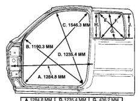
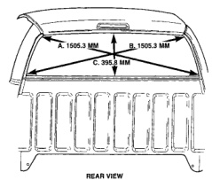

# SPECIFICATIONS (Continued)

*Fig. 11 Body Dimensions-Club Cab]*

**LH SIDE VIEW**

| Dimension | Measurement |
|-----------|-------------|
| A. | 1284.8 MM |
| B. | 1190.3 MM |
| C. | 1546.3 MM |
| D. | 1235.4 MM |
| E. | 582.6 MM |
| F. | 538.8 MM |
| G. | 436.2 MM |
| H. | 440.5 MM |
| J. | 426.8 MM |

- **A.** Centerline of A-Pillar gaging hole to centerline of seat belt retractor hole at B-Pillar.
- **B.** Center of radius at rear lower door opening flange inner edge to center of radius at cowl flange edge.
- **C.** Center of radius at front lower door opening flange inner edge to center of radius at upper opening rear flange inner edge.
- **D.** Center of radius at rear lower door opening flange inner edge to center of radius at upper front flange inner edge.
- **E.** Lower rear corner inner flange edge to upper front corner inner flange edge of quarter glass opening.
- **F.** Lower front corner inner flange edge to upper rear corner inner flange edge of quarter glass opening.
- **G.** Upper inner flange lower edge to lower flange upper edge of quarter glass opening.

*Fig. 12 Cargo Door Quarter Glass Opening Dimensions*

| Dimension | Measurement |
|-----------|-------------|
| E. | 484.14 |
| F. | 456.83 |
| G. | 424.97 |
| H. | 427.26 |
| J. | 418.38 |

[Figure: Fig. 12 Body Dimensions-Rear View]

**REAR VIEW**

| Dimension | Measurement |
|-----------|-------------|
| A. | 1505.3 MM |
| B. | 1505.3 MM |
| C. | 395.3 MM |

- **A. & B.** Center of radius at top corner to center of radius at lower corner of glass mounting flange.
- **C.** Lower edge of upper back glass mounting flange to upper edge of lower back glass mounting flange measurement taken at centerline of rear glass opening.

---

## TORQUE SPECIFICATIONS

| DESCRIPTION | TORQUE |
|-------------|--------|
| Cab Chassis adapter nut | 108 N-m (80 ft. lbs.) |
| Front bumper brkt-to-frame nut | 68 N-m (50 ft. lbs.) |
| Front bumper outer brace bolt | 68 N-m (50 ft. lbs.) |
| Rear bumper-to-brace nut | 40 N-m (30 ft. lbs.) |
| Rear bumper brace-to-brkt nut | 101 N-m (75 ft. lbs.) |
| Rear bumper brkt-to-frame nut | 101 N-m (75 ft. lbs.) |
| Skid plate crossmember-to-frame bolt | 54 N-m (40 ft. lbs.) |
| Skid plate-to-crossmember bolt | 40 N-m (30 ft. lbs.) |
| Skid plate-to-trans crossmember bolt | 54 N-m (40 ft. lbs.) |
| Spare tire winch bolt | 27 N-m (20 ft. lbs.) |
| Trailer hitch nut | 108 N-m (80 ft. lbs.) |

*Source: 13 Frame and Bumpers, Page 10*
