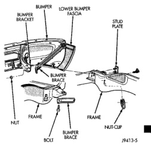

# FRAME AND BUMPERS

## CONTENTS

| Section | Page |
|---------|------|
| BUMPERS | 1 |
| FRAME | 4 |

---

# BUMPERS

## INDEX

### REMOVAL AND INSTALLATION

| Topic | Page |
|-------|------|
| FRONT BUMPER | 1 |
| FRONT BUMPER AIR DAM | 2 |
| FRONT BUMPER LOWER FASCIA | 2 |
| FRONT BUMPER UPPER FASCIA | 1 |
| REAR BUMPER | 3 |
| REAR VALENCE PANEL | 3 |

---

## REMOVAL AND INSTALLATION

### FRONT BUMPER

#### REMOVAL

(1) Support front bumper on a suitable lifting device.

(2) Remove bolt holding front bumper brace to frame rail (Fig. 1).

(3) Remove nuts and stud plates holding front bumper to end of frame rail.

(4) Disengage wire connectors from horns.

(5) Disengage wire connectors from fog lamps, if equipped.

(6) Separate front bumper from vehicle.

#### INSTALLATION

Reverse the preceding operation.

### FRONT BUMPER UPPER FASCIA

#### REMOVAL

(1) Open hood.

(2) Remove fasteners at fender side openings.

(3) Disengage clips holding upper fascia to bumper face bar (Fig. 2).

(4) Separate fascia from bumper.

*Fig. 2 Front Bumper]*

*Source: 13 Frame and Bumpers, Page 1*
