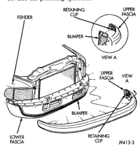
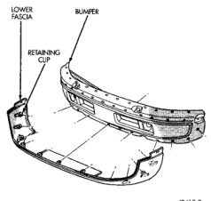
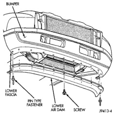

# REMOVAL AND INSTALLATION (Continued)

#### INSTALLATION

Reverse the preceding operation.

*Fig. 2 Front Bumper Upper Fascia]*

### FRONT BUMPER LOWER FASCIA

#### REMOVAL

(1) Open hood.

(2) Remove fasteners at side fender openings.

(3) Remove lower air dam.

(4) Disengage clips holding end of upper fascia to bumper face bar (Fig. 3).

(5) Disengage clips holding lower fascia to bumper face bar.

(6) Separate lower fascia from bumper.

#### INSTALLATION

Reverse the preceding operation.

*Fig. 3 Front Bumper Lower Fascia]*

### FRONT BUMPER AIR DAM

#### REMOVAL

(1) Remove pin-type fasteners holding air dam to bottom of front bumper (Fig. 4).

(2) Remove screws holding air dam to bottom of front bumper.

(3) Separate air dam from vehicle.

#### INSTALLATION

Reverse the preceding operation.

*Fig. 4 Front Bumper Air Dam]*

*Source: 13 Frame and Bumpers, Page 2*
