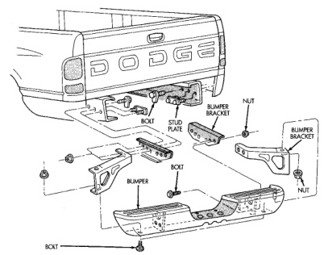
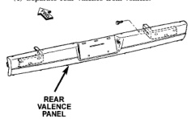

# REMOVAL AND INSTALLATION (Continued)

### REAR BUMPER

#### REMOVAL

(1) Support rear bumper on a suitable lifting device.

(2) Remove bolts holding rear bumper braces to frame rails (Fig. 5).

(3) Disengage license plate lamp wire connector from body wire harness, if equipped.

(4) Separate rear bumper from vehicle.

#### INSTALLATION

Reverse the preceding operation.

### REAR VALENCE PANEL

#### REMOVAL

(1) Support rear valence panel on a suitable lifting device.

(2) Remove bolts attaching rear valence to frame rails (Fig. 6).

(3) Disengage license plate lamp wire connector from body wire harness, if equipped.

(4) Separate rear valence from vehicle.

*Fig. 6 Rear Valence Panel]*

#### INSTALLATION

Reverse the preceding operation.

*Fig. 5 Rear Bumper]*

*Source: 13 Frame and Bumpers, Page 3*
