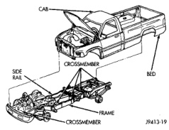
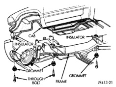

# FRAME

## INDEX

### GENERAL INFORMATION

| Topic | Page |
|-------|------|
| GENERAL INFORMATION | 4 |

### SERVICE PROCEDURES

| Topic | Page |
|-------|------|
| FRAME SERVICE | 5 |

### REMOVAL AND INSTALLATION

| Topic | Page |
|-------|------|
| CAB CHASSIS ADAPTER BRACKET | 6 |
| SPARE TIRE WINCH | 6 |
| TRAILER HITCH | 7 |
| TRANSFER CASE SKID PLATE | 6 |

### SPECIFICATIONS

| Topic | Page |
|-------|------|
| TORQUE SPECIFICATIONS | 10 |
| VEHICLE DIMENSIONS | 7 |

---

## GENERAL INFORMATION

BR trucks have a ladder-type frame (Fig. 1) with box-section front rails, dropped center section and open-channel side rails in the rear.

Cross members attached to the frame side rails with rivets, welds or bolts form a ladder-type construction (Fig. 1). The cab is isolated from the frame with rubber load cushions (Fig. 2) with through-bolts. The cargo box or bed is attached to the frame with bolts. Refer to Group 23, Body for cargo box service procedures.

*Fig. 1 Frame]*

*Fig. 2 Cab Mounts]*

The frame is designed to absorb and dissipate flexing and twisting due to acceleration, braking, cornering and road surface variances without bending when subjected to normal driving conditions. The frame is the mounting platform for the following systems and components:

- Front and rear suspension systems.
- Engine, transmission, and transfer case.
- Steering gear and linkage.
- Exhaust system and heat shields.
- Fuel cell and fuel line tubing.
- Front end sheet metal and radiator closure panel.
- Skid plate.
- Passenger cab.
- Cargo box or bed.
- Spare tire winch.
- Front and rear bumper systems.

*Source: 13 Frame and Bumpers, Page 4*
