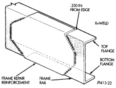

# SERVICE PROCEDURES

## FRAME SERVICE

### SAFETY PRECAUTIONS AND WARNINGS

**WARNING: USE EYE PROTECTION WHEN GRINDING OR WELDING METAL. SERIOUS EYE INJURY CAN RESULT. BEFORE PROCEEDING WITH FRAME REPAIR INVOLVING GRINDING OR WELDING, VERIFY THAT VEHICLE FUEL SYSTEM IS NOT LEAKING OR IN CONTACT WITH REPAIR AREA. PERSONAL INJURY CAN RESULT. DO NOT ALLOW OPEN FLAME TO CONTACT PLASTIC BODY PANELS. FIRE OR EXPLOSION CAN RESULT. WHEN WELDED FRAME COMPONENTS ARE REPLACED, 100% PENETRATION WELD MUST BE ACHIEVED DURING INSTALLATION. IF NOT, DANGEROUS OPERATING CONDITIONS CAN RESULT. STAND CLEAR OF CABLES OR CHAINS ON PULLING EQUIPMENT DURING FRAME STRAIGHTENING OPERATIONS. PERSONAL INJURY CAN RESULT. DO NOT VENTURE UNDER A HOISTED VEHICLE THAT IS NOT SUPPORTED ON SAFETY STANDS. PERSONAL INJURY CAN RESULT.**

**CAUTION:** Do not reuse damaged fasteners, quality of repair would be suspect. Do not drill holes in top or bottom frame rail flanges, frame rail failure can result. Do not use softer than Grade 5 bolts to replace production fasteners, loosening or failure can result. When using heat to straighten frame components do not exceed 566°C (1050°F), metal fatigue can result. Welding the joints around riveted cross members and frame side rails can weaken frame.

### FRAME STRAIGHTENING

When necessary, a conventional frame that is bent or twisted can be straightened by application of heat. The temperature must not exceed 566°C (1050°F). The metal will have a dull red glow at the desired temperature. Excessive heat will decrease the strength of the metal and result in a weakened frame.

Welding the joints around riveted cross members and frame side rails is not recommended.

A straightening repair process should be limited to frame members that are not severely damaged. The replacement bolts, nuts and rivets that are used to join the frame members should conform to the same specifications as the original bolts, nuts and rivets.

### FRAME REPAIRS

#### DRILLING HOLES

Do not drill holes in frame side rail top and bottom flanges, metal fatigue can result causing frame failure. Holes drilled in the side of the frame rail must be at least 38 mm (1.5 in.) from the top and bottom flanges.

Additional drill holes should be located away from existing holes.

#### WELDING

Use MIG, TIG or arc welding equipment to repair welded frame components.

Frame components that have been damaged should be inspected for cracks before returning the vehicle to use. If cracks are found in accessible frame components perform the following procedures.

(1) Drill a hole at each end of the crack with a 3 mm (0.125 in.) diameter drill bit.

(2) Using a suitable die grinder with 3 inch cut off wheel, V-groove the crack to allow 100% weld penetration.

(3) Weld the crack.

(4) If necessary when a side rail is repaired, grind the weld smooth and install a reinforcement channel (Fig. 3) over the repaired area.

**NOTE:** If a reinforcement channel is required, the top and bottom flanges should be 0.250 inches narrower than the side rail flanges. Weld only in the areas indicated (Fig. 3).

*Fig. 3 Frame Reinforcement]*

### FRAME FASTENERS

Bolts, nuts and rivets can be used to repair frames or to install a reinforcement section on the frame. Bolts can be used in place of rivets. When replacing rivets with bolts, install the next larger size diameter

*Source: 13 Frame and Bumpers, Page 5*
