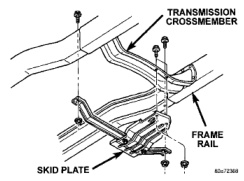
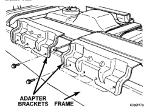
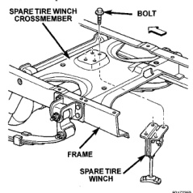

# SERVICE PROCEDURES (Continued)

bolt to assure proper fit. If necessary, ream the hole out just enough to sufficiently receive the bolt.

Conical-type washers are preferred over the split-ring type lock washers. Normally, grade-5 bolts are adequate for frame repair. **Grade-3 bolts or softer should not be used.** Tightening bolts/nuts with the correct torque, refer to the Introduction Group at the front of this manual for tightening information.

---

# REMOVAL AND INSTALLATION

## CAB CHASSIS ADAPTER BRACKET

### REMOVAL

(1) Remove bolts attaching cab chassis adapter brackets to frame rail (Fig. 4).

(2) Separate cab chassis adapter brackets from frame rail.

*Fig. 4 Cab Chassis Adapter Brackets]*

### INSTALLATION

(1) Position cab chassis adapter brackets on frame rail.

(2) Install bolts attaching cab chassis adapter brackets to frame rail.

## TRANSFER CASE SKID PLATE

### REMOVAL

(1) Hoist and support vehicle on safety stands.

(2) Remove bolts holding skid plate to frame rails (Fig. 5).

(3) Separate skid plate from vehicle.

*Fig. 5 Skid Plate]*

### INSTALLATION

(1) Position skid plate on vehicle.

(2) Install bolts holding skid plate to frame rails.

(3) Remove safety stands and lower vehicle.

## SPARE TIRE WINCH

### REMOVAL

(1) Remove spare tire from under vehicle.

(2) Remove bolts holding spare tire winch to spare tire bracket (Fig. 6).

(3) Separate spare tire winch from vehicle.

*Fig. 6 Spare Tire Winch]*

### INSTALLATION

(1) Position spare tire winch on vehicle.

(2) Install bolts holding spare tire winch to spare tire bracket.

(3) Install spare tire.

*Source: 13 Frame and Bumpers, Page 6*
