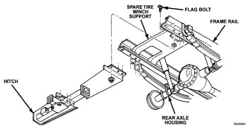

# REMOVAL AND INSTALLATION (Continued)

## TRAILER HITCH

### REMOVAL

(1) Support trailer hitch on a suitable lifting device.

(2) Remove fasteners holding trailer wiring connector to trailer hitch, if equipped.

(3) Remove bolts holding trailer hitch to frame rails (Fig. 7).

(4) Separate trailer hitch from vehicle.

### INSTALLATION

(1) Position trailer hitch on vehicle.

(2) Install the bolts holding trailer hitch to frame rails and remove lifting device.

(3) Install fasteners holding trailer wiring connector to trailer hitch, if equipped.

*Fig. 7 Trailer Hitch]*

---

# SPECIFICATIONS

## VEHICLE DIMENSIONS

Frame dimensions are listed in inch scale. All dimensions are from center to center of Principal Locating Point (PLP), or from center to center of PLP and fastener location (Fig. 8), (Fig. 9), (Fig. 10), (Fig. 11) and (Fig. 12).

*Source: 13 Frame and Bumpers, Page 7*
