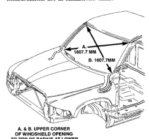
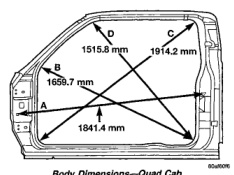

# SPECIFICATIONS (Continued)

## LENGTH DIMENSIONS FOR DIFFERING WHEELBASES*

| WHEELBASE | LENGTH A | LENGTH B | LENGTH C |
|-----------|----------|----------|----------|
| 118 | 2118.0 | 3663.6 | 4185.4 |
| 134 | 2118.0 | 3994.5 | 4693.4 |
| 138 | 2626.0 | 4096.1 | 4693.4 |
| 154 | 2626.0 | 4502.5 | 5201.4 |
| 162 | 2118.0 | 4705.0 | 5042.5 |

*Measurements are in Millimeters (mm).

*Fig. 9 Body Dimensions-Front View]*

**A. & B.** Upper corner of windshield opening to top of radius at lower corner of opening.

*Fig. 10 Body Dimensions-Quad Cab*

[Figure: Fig. 10 Body Dimensions-Conventional Cab]

**LH SIDE VIEW**

- **A.** Centerline of A-Pillar gaging hole to centerline of seat belt retractor hole at B-Pillar.
- **B.** Centerline of radius at rear lower door opening flange inner edge to center of radius at cowl flange edge.
- **C.** Centerline of radius at front lower door opening flange inner edge to center of radius at upper opening rear flange inner edge.
- **D.** Centerline of radius at rear lower door opening flange inner edge to center of radius at upper front flange inner edge.

*Source: 13 Frame and Bumpers, Page 9*
