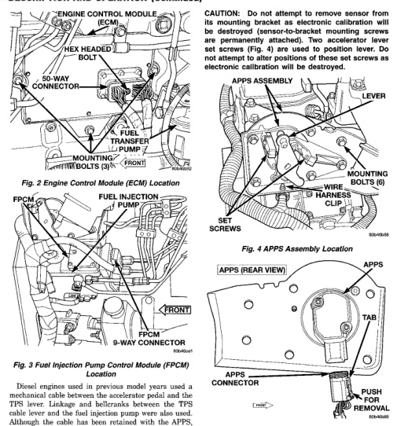

*Fig. 2 Engine Control Module (ECM) Location*

Diesel engines used in previous model years used a mechanical cable between the accelerator pedal and the TPS lever. Linkage and bellcranks between the TPS cable lever and the fuel injection pump were also used. Although the cable has been retained with the APPS, the linkage and belicranks between the cable lever and the fuel iniection pump are no longer used. The APPS assembly is located at the top-left-front of the engine (Fig. 4). A plastic cover is used to cover the assembly. The actual sensor is located behind its mounting bracket (Fig. 5). The APPS is serviced (replaced) as one assembly including the lever, brackets and sensor. The APPS is calibrated and permanently positionod to its mounting bracket.

*Fig. 4 APPS Assembly Location*

The battery voltage input provides power to the Engine Control Module (ECM). It also informs the ECM what voltage level is being supplied by the generator once the vehicle is running. The battery input also provides the voltage that is needed to keep the ECM memory alive. The memory stores Diagnostic Trouble Code (DTC) messages.
