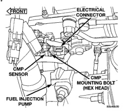
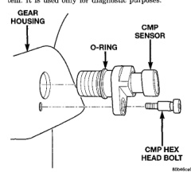

The Camshaft Position Sensor (CMP) (Fig. 6) contains a hall effect device called a sync signal generator to generate a sync signal. The sync signal generator detects a machined hole on the rear face of the camshaft drive gear. The signal is used to verify the position of the #1 cylinder during engine operation. When the leading edge of the machined hole enters the tip of the CMP, the interruption of magnetic field causes the voltage to switch high resulting in a signal of approximately 5 volts. When the trailing edge of the machined hole leaves the tip of the CMP, the change of the magnetic field causes the voltage to switch low to 0 volts. The CMP is located below the fuel injection pump (Fig. 7). It is attached to the back of the timing gear cover housing. The CMP is not used for any control of fuel system. It is used only for diagnostic purposes.

*Fig. 6*

The Engine Control Module (ECM) and the Powertrain Control Module (PCM) send certain signals through the CCD bus circuits. Some of these signals are parallel circuited between the two control modules (ECM and PCM). These signals are used to control certain instrument panel located items and to determine certain identification numbers. Refer to Group SE, Instrument Panel and Gauges for additional information.

*Fig. 7*

The Crankshaft Position Sensor (CKP) is located on the lower left-rear side of the engine behind the starter motor (Fig. 8). Engine speed and crankshaft position are provided through the CKP. The sensor generates pulses that are the input sent to the Engine Control Module (ECM). The ECM interprets the sensor input to determine the crankshaft position. The ECM then uses this position, along with other inputs, to determine injector firing sequence and fuel timing. The sensor must be powered up by 5 volts to operate. The sensor is a hall effect device combined with an internal magnet. It is also sensitive to steel within a certain distance from it. The engine crankshaft is equipped with a bolt-on tone wheel (Fig. 9). The tone wheel is equipped with 35 teeth and a gap where the 36th tooth should be placed (Fig. 9). This missing tooth indicates to the ECM the relative position of cylinder #1 to the Top Dead Center (TDC) position. This does not mean that cylinder #1 is at TDC. When the CKP is aligned with the missing tooth, the missing tooth is 60 degrees away from cylinder #1 TDC position. The teeth cause pulses to be generated when they pass under the sensor. The pulses are the input to the ECM.
