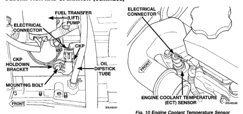
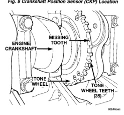

*Fig. 8 Crankshaft Position Sensor (CKP) Location*

*Fig. 10*

The engine coolant temperature sensor is installed into the front of the cvlinder head near to the thermostat housing (Fig. 10) and protrudes into a water jacket. The sensor provides an input voltage to the Engine Control Module (ECM) to monitor coolant temperature. The ECM uses this input along with inputs from other sensors for engine protection, fuel timing and fuel control. As coolant temperature varies, the coolant temperature sensor resistance will change. This change in resistance results in a different input voltage to the ECM.

Two different fuel temperature sensors are used. One of the sensors is located inside of the Bosch VP44 fuel injection pump and is a non-serviceable part. It is used to check fuel temperature within the injection pump and to set a Diagnostic Trouble Code (DTC) if a specific high fuel temperature has been reached. If high temperature has been reached, engine power will be de-rated by the Engine Control Module (ECM). The other fuel temperature sensor is located in the top of the fuel filter housing and is serviceable. It is used to control the fuel heater element. Refer to Fuel Heater Description and Operation for additional information.

The IAT provides an input voltage to the Engine Control Module (ECM) indicating intake manifold air temperature. The input is used along with inputs from other sensors for engine protection, fuel timing and fuel control. As the temperature of the air-fuel stream in the manifold varies, the sensor resistance changes. This results in a different input voltage to the ECM. The intake manifold air temperature sensor is installed into the rear of the intake manifold (Fig. 11) with the sensor element extending into the air stream.
