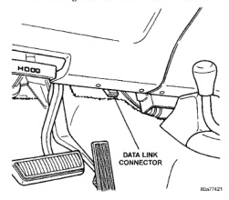

Provides a signal proportional to the transmission governor pressure. It provides feedback for control of the governor pressure solenoid. which regulates transmission governor pressure. This input is used with 4-speed electronic transmissions only.

The Vehicle Speed Sensor (VSS) is no longer used for any Dodge truck in the 1998 model year. Vehicle speed and distance covered are measured by the Rear Wheel Speed Sensor. The sensor is mounted to the rear axle. A signal is sent from this sensor to the Controller Antilock Brake (CAB) computer. A signal is then sent from the CAB to the Powertrain Control Module (PCM) to determine vehicle speed and distance covered. The PCM will then determine strategies for fuel system and speed control system operation. Refer to Odometer and Trip Odometer in Group 8E, Instrument Panel for additional information.

The A/C relay is located in the Power Distribution Center (PDC). Refer to label under PDC cover for relay location. The powertrain control module (PCM) activates the A/C compressor through the A/C clutch relay. The PCM regulates A/C compressor operation by switching the ground circuit for the AC clutch relay on and off. The PCM will also de-energize the relay if coolant temperature exceeds 125°C (257°F).

This circuit controls operation of the ASD relay. It provides the necessary power to operate the generator field control for charging system operation. The ASD relay is located in the power distribution center (PDC). The PDC is located in the engine compartment. For location of relay within the PDC, refer to PDC cover.

This output from the Powertrain Control Module (PCM) regulates charging system voltage to the generator field source (+) circuit. The voltage range is 12,9 to 15.0 volts. Models of previous years had used the ASD relay (directly) to apply the 12 volt + power supply to the generator field source (+) circuit. Refer to Groups 8A and 8C for charging system information.

This output from the Powertrain Control Module (PCM) regulates charging system ground control to the generator field driver (-) circuit. Refer to Groups 8A and 8C for charging system information.

If the powertrain control module (PCM) senses a low charging condition in the charging system, it will illuminate the generator lamp (if equipped) on the instrument panel. For example, during low idle with all accessories turned on, the lamp may momentarily go on. Refer to Groups 8A and 8C for charging system information.

The 16-way data link connector (diagnostic scan tool connector) links the Diagnostic Readout Box (DRB) scan tool or the Mopar Diagnostic System (MDS) with both the Powertrain Control Module (PCM) and the Engine Control Module (ECM). The data link connector (Fig. 17) is located at lower edge of instrument panel near steering column . For operation of the DRB scan tool, refer to the appropriate Powertrain Diagnostic Procedures service manual.

*Fig. 17*

OUTPUT Refer to Group 25, Emission Control System for information.
