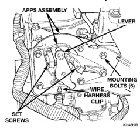
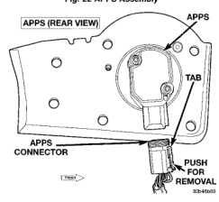

*Fig. 22 APPS Assembly*

*Fig. 20*

(1) Disconnect both negative battery cables at both batteries. (2) Remove cable cover (Fig. 20). Cable cover is attached with 2 Phillips screws, 2 plastic retention clips and 2 push tabs (Fig. 20). Remove 2 Phillips scrows and carefully pry out 2 retention clips. After clip removal, push rearward on front tab, and upward on lower tab for cover removal. (3) Using finger pressure only, disconnect end of speed control servo cable from throttle lever pin by pulling forward on connector while holding lever rearward (Fig. 21).DO NOT try to pull connector off perpendicular to lever pin. Connector will be broken.

(4) Using two small screwdrivers, pry throttle cable connector socket from throttie lever ball (Fig. 21). Be very careful not to bend throttle lever arm. (5) Disconnect transmission control cable at lever arm (if equipped). Refer to Group 21, Transmission. (6) Squeeze pinch tabs on speed control cable (Fig. 21) and pull cable rearward to remove from cable mounting bracket. (7) Squeeze pinch tabs on throttle cable (Fig. 21) and pull cable rearward to remove from cable mounting bracket. (8) If equipped with an automatic transmission, refer to Group 21, Transmission for transmission control cable removal procedures. (9) Disconnect wiring harness clip (Fig. 22) at bottom of bracket. (10) Remove 6 mounting bolts (Fig. 22) and partially remove APPS assembly from engine. After assembly is partially removed, disconnect electrical connector from bottom of sensor by pushing on connector tab (Fig. 23). (11) Remove APPS assembly from engine.

(1) Snap electrical connector into bottom of sensor. (2) Position APPS assembly to engine and install 6 bolts. Tighten bolts to 12 N.m (105 in. lbs.) torque. (3) Connect wiring harness clip (Fig. 22) at bottom of bracket. (4) If equipped with an automatic transmission, refer to Group 21, Transmission for transmission control cable installation procedures. (5) Install speed control cable into mounting bracket. Be sure pinch tabs (Fig. 21) have secured cable. (6) Install throttle cable into mounting bracket. Be sure pinch tabs (Fig. 21) have secured cable. (7) Connect throttle cable at lever (snaps on). (8) Connect speed control cable to lever by pushing cable connector rearward onto lever pin while holding lever forward. (9) Install cable cover. (10) Connect both negative battery cables to both batteries. (11) ECM Calibration: Turn kev to ON position. Without starting engine, slowly press throttle pedal to floor and then slowly release. This step must be done (one time) to ensure accelerator pedal position sensor calibration has been learned by ECM. If not done, possible DTC's may be set. (12) Use DRB scan tool to erase any DTC's from ECM/PCM.
