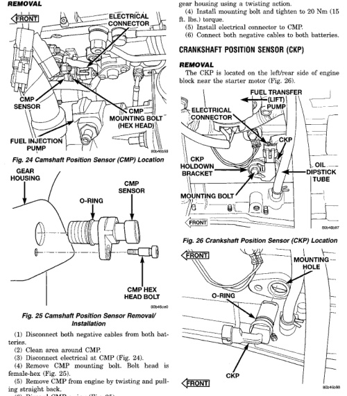

*Fig. 24*

The camshaft position sensor (CMP) is located below the fuel injection pump (Fig. 24). It is attached to the back of the timing gear cover housing.

(2) Clean area around CMP. (3) Disconnect electrical at CMP (Fig. 24). (4) Remove CMP mounting bolt. Bolt head is female-hex (Fig. 25). (5) Remove CMP from engine by twisting and pulling straight back. (6) Discard CMP o-ring (Fig. 25).

(1) Install new o-ring to CMP. Apply clean engine oil to o-ring. (2) Clean area around CMP mounting hole. (3) To prevent tearing o-ring, install CMP into gear housing using a twisting action. (4) Install mounting bolt and tighten to 20 Nm (15 ft. Ibs.) torque. (5) Install electrical connector to CMP. (6) Connect both negative cables to both batteries.

*Fig. 27 CKP Removal/Installation*
