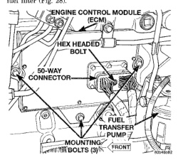

(1) Disconnect both negative battery cables at both batteries. (2) Remove starter motor. Refer to Group 8B. Starter. (3) Disconnect electrical connector at CKP (Fig. 26). (4) Remove CKP mounting bolt and hold down bracket (Fig. 26). (5) Pull CKP from engine block with a slight twisting action. (6) Discard old CKP o-ring (Fig. 27).

(1) Instal! new o-ring to CKP. Apply clean engine oil to o-ring. (2) Clean area around CKP mounting hole. (3) To prevent tearing o-ring, install CKP into engine block using a twisting action. (4) Position hold down bracket and install mounting bolt. (5) Tighten bolt to 24 N-m (18 ft, lbs.) torque. (6) Install starter motor. Refer to Group 8B, Starter. (7) Connect both negative battery cables at both batteries.

The ECM is bolted to the engine block behind the fuel filter (Fig. 28).

*Fig. 26 Engine Control Module (ECM) Location and Mountina*

(1) Record any Diagnostic Trouble Codes (DTC's) found in the PCM or ECM. To avoid possible voltage spike damage to either the Powertrain Control Module (PCM) or ECM, ignition

key must be off, and negative battery cables must be disconnected before unplugging ECM connectors. (2) Disconnect both negative battery cables at both batteries. (3) Remove 50-way electrical connector bolt at ECM (Fig. 28). Note: Connector bolt is female 4mm hex head. To remove bolt, use a ball-hex bit or ballhex screwdriver such as Snap-On ® 4mm SDABM4. As bolt is being removed, very carefully remove connector from ECM. (4) Remove three ECM mounting bolts and remove ECM from vehicle.

Do not apply paint to back of ECM. Poor ground will result. (1) Clean ECM mounting points at engine block. (2) Position ECM to engine block and install 3 mounting bolts. Tighten bolts to 24 N-m (18 ft. Ibs.). (3) Check pin connectors in ECM and 50-way connector for corrosion or damage. Repair as necessary. (4) Clean pins in 50-way electrical connector with a quick-dry electrical contact cleaner. (5) Very carefully install 50-way connector to ECM. Tighten connector hex bolt. (6) Install battery cables. (7) Turn key to ON position. Without starting engine, slowly press throttle pedal to floor and then slowly release. This step must be done (one time) to ensure accelerator pedal position sensor calibration has been learned by ECM. If not done, possible DTC's may be set. (8) Use DRB scan tool to erase any stored companion DTC's from PCM.

The Engine Coolant Temperature (ECT) sensor is located at the front of the cylinder head near the thermostat (Fig. 29).

COOLING WARNING: THE SYSTEM MAY BE UNDER PRESSURE. HOT COOLANT CAN CAUSE BURNS. OBSERVE THE WARNINGS IN GROUP 7. COOLING SYSTEM BEFORE PROCEEDING.

(1) Partially drain cooling system until coolant

• level is below cvlinder head. (2) Disconnect ECT sensor electrical connector from sensor (Fig. 29). (3) Remove ECT sensor from cylinder head (Fig. 30). (4) Discard sensor o-ring (Fig. 30).
