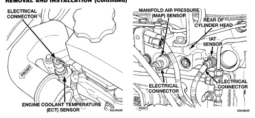
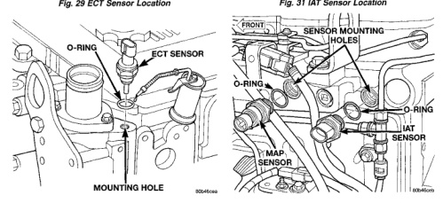

*Fig. 29 ECT Sensor Location*

(1) Clean sensor mounting hole (Fig. 30) of rust or contaminants. (2) Install new o-ring to sensor. Apply clean engine oil to sensor o-ring and sensor threads. (3) Install ECT sensor into cylinder head. Tighten to 14 N-m (10 ft. lbs.) torque. (4) Connect sensor electrical connector. (5) Fill cooling system and check for coolant leaks. Refer to Group 7, Cooling System for procedures.

The IAT sensor is located in the left/rear side of the intake manifold (Fig. 31).

*Fig. 31 IAT Sensor Location*

(1) Disconnect electrical connector from IAT sensor (Fig. 31). (2) Remove IAT sensor from intake manifold (Fig. 32).

(3) Discard sensor o-ring (Fig. 32).

(1) Clean sensor mounting hole (Fig. 32) of rust or contaminants. (2) Install new o-ring to sensor. Apply clean engine oil to sensor o-ring and sensor threads. (3) Install IAT sensor into intake manifold. Tighten to 14 N.m (10 ft. lbs.) torque. (4) Connect sensor electrical connector.

*Fig. 30*
