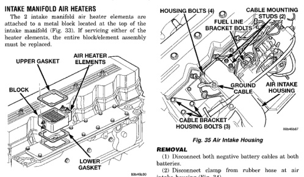
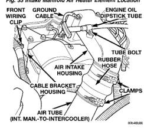

*Fig. 33 Intake Manifold Air Heater Element Location*

*Fig. 34 Air Tube (Intercooler-to-Air Intake Housing)*

(1) Disconnect both negative battery cables at both batteries. (2) Disconnect clamp from rubber hose at air intake housing (Fig. 34). (3) Disconnect rubber hose at air intake housing (Fig. 34). (4) Remove engine oil dipstick tube mounting bolt (Fig. 34). Position dipstick tube to the side. (5) Disconnect heater electrical cables at cable mounting studs (Fig. 35). (6) Remove 4 housing bolts (Fig. 35). (7) Remove air intake housing from top of heater elements. (8) Remove heater element assembly from intake manifold. (9) Clean old gasket material from air intake housing and intake manifold. (10) Clean old gasket material from both ends of heater block (Fig. 33).

(1) Using 2 new gaskets, position element assembly and air housing to intake manifold. (2) Position ground cable (Fig. 35) to air housing. (3) Install 4 housing bolts and tighten to 24 N-m (18 ft. lbs.) torque. (4) Connect heater cables at cable mounting studs (Fig. 35). (5) Install engine oil dipstick tube and mounting bolt. (6) Connect rubber hose to air intake housing. (7) Connect clamp to rubber hose at air intake housing. (8) Connect both negative battery cables at both batteries.
