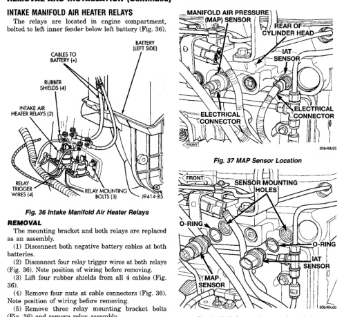

*Fig. 36*

The mounting bracket and both relays are replaced as an assembly. (1) Disconnect both negative battery cables at both batteries. (2) Disconnect four relay trigger wires at both relays (Fig. 36). Note position of wiring before removing. (3) Lift four rubber shields from all 4 cables (Fig. 36). (4) Remove four nuts at cable connectors (Fig. 36), Note position of wiring before removing. (5) Remove three relay mounting bracket bolts (Fig. 36) and remove relay assembly.

(1) Install relay assembly to inner fender. Tighten mounting bolts to 4.5 N-m (40 in. Ibs.) torque. (2) Connect eight electrical connectors to relays. (3) Connect battery cables to both batteries.

The MAP sensor is located in the left/rear side of the intake manifold (Fig. 37).

(1) Disconnect electrical connector from MAP sensor (Fig. 37). (2) Remove MAP sensor from intake manifold (Fig. 38). (3) Discard sensor o-ring (Fig. 38).

*Fig. 37 MAP Sensor Location*

(1) Clean sensor mounting hole (Fig. 38) of rust or contaminants. (2) Install new o-ring to sensor. Apply clean engine oil to sensor o-ring and sensor threads. (3) Install MAP sensor into intake manifold. Tighten to 14 N-m (10 ft. lbs.) torque. (4) Connect sensor electrical connector.
