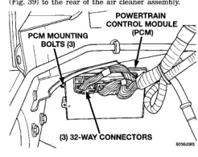

The PCM is located in the engine compartment (Fig. 39) to the rear of the air cleaner assembly.

*Fig. 39 PCM Location and Mounting*

To avoid possible voltage spike damage to either the PCM or the ECM, ignition key must be off, and both negative battery cables must be disconnected before unplugging PCM connectors. (1) Disconnect negative battery cables at both batteries. (2) Remove cover over electrical connectors. Cover snaps onto PCM. (3) Carefully unplug the three 32-way connectors from PCM. (4) Remove three PCM mounting bolts and remove PCM from vehicle.

(1) Install PCM and mounting bolts to vehicle. (2) Tighten bolts to 4 N-m (35 in. Ibs.). (3) Check pin connectors in the PCM and the three 32-way connectors for corrosion or damage. Repair as necessary. (4) Install three 32-way connectors. (5) Install cover over electrical connectors. Cover snaps onto PCM. (6) Install battery cables. (7) Use the DRB scan tool to reprogram new PCM with vehicles original Identification Number (VIN) and original vehicle mileage. If this step is not done, a Diagnostic Trouble Code (DTC) may be set.

The Water-In-Fuel (WIF) sensor is located at the side of fuel filter/water separator canister. Refer to Fuel Filter/Water Separator Removal/Installation for WIF sensor removal/installation procedures.
