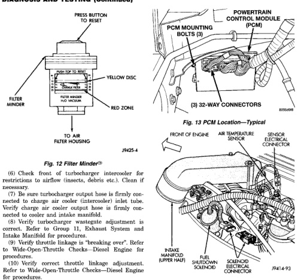

# 14 - 126 FUEL SYSTEM BR

### DIAGNOSIS AND TESTING (Continued)

*Fig. 13 Filter Minder®]*
• FILTER MINDER
• PRESS BUTTON TO RESET
• YELLOW DISC
• RED ZONE
• NO VACUUM
• TO AIR FILTER HOUSING
• PH25-4

[Figure: Fig. 13 PCM Location—Typical]
• PCM MOUNTING BOLTS (3)
• (3) 32-WAY CONNECTORS
• POWERTRAIN CONTROL MODULE (PCM)
• 8066698

[Figure: Fig. 14 Air Temperature Sensor and Fuel Shutdown Solenoid]
• FRONT OF ENGINE
• AIR TEMPERATURE SENSOR
• SENSOR ELECTRICAL CONNECTOR
• FUEL SHUTDOWN SOLENOID
• INJECTION PUMP
• SOLENOID ELECTRICAL CONNECTOR
• PAI-4-93

(6) Check front of turbocharger intercooler for restrictions to airflow (insects, debris etc.). Clean if necessary.

(7) Be sure turbocharger output hose is firmly connected to charge air cooler (intercooler) inlet tube. Verify charge air cooler output hose is firmly connected to cooler and intake manifold.

(8) Verify turbocharger wastegate adjustment is correct. Refer to Group 11, Exhaust System and Intake Manifold for procedures.

(9) Verify throttle linkage is "breaking over". Refer to Wide-Open-Throttle Checks—Diesel Engine for procedures.

(10) Verify correct throttle linkage adjustment. Refer to Wide-Open-Throttle Checks—Diesel Engine for procedures.

(11) Verify correct Throttle Position Sensor (TPS) output voltage. Refer to Throttle Position Sensor—Diesel Engine, Removal/Installation/Testing/Adjustment.

(12) Be sure battery connections (on both batteries) are tight and not corroded.

(13) Be sure three 32-way connectors are fully engaged into the powertrain control module (PCM) (Fig. 13).

(14) Verify electrical connector is firmly connected to fuel shutdown solenoid on the injection pump (Fig. 14). Inspect connector for corrosion or damage.

(15) Verify electrical connector is firmly connected to intake manifold air temperature sensor. Inspect connector for corrosion or damaged wires. The sensor is located on top of intake manifold (Fig. 14).

(16) Be sure electrical connections at intake manifold air heater relays (Fig. 15) are tight and not corroded.

(17) Be sure intake manifold air heater electrical cable connections at intake manifold are tight and free of corrosion (Fig. 16).

(18) Inspect all fuel supply and return lines for signs of damage or kinking.

(19) Inspect all fuel supply and return lines for signs of leakage.

(20) Inspect throttle linkage and accelerator linkage for binding.

(21) Be sure throttle return spring is connected.