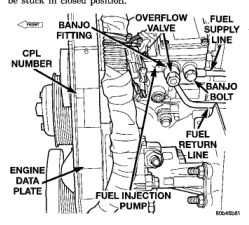

(10) Locate and disconnect fuel supply line quickconnect fitting at left-rear of engine (Fig. 22). After disconnecting line, plastic clip will remain attached to metal fuel line at engine. Carefully remove clip from metal line. Snap same clip into fuel supply hose. (11) Install Special Rubber Adapter Hose Tool 6631 (3/8") into ends of disconnected fuel supply line. (12) Install transducer from PEP module to brass "T" fitting on tool 6631. (13) Hook up DRB scan tool to transducer. (14) Start engine and record vacuum reading with engine speed at high-idle (high-idle means engine speed is at 100 percent throttle and no load). The fuel restriction test MUST be done wth engine speed at high-idle. (15) If vacuum reading is less than 6 in/hg. (0-152 mm hg.), test is OK. If vacuum reading is higher than 6 in/hg. (152 mm hg.), restriction exists in fuel supply line or in fuel tank module. Check fuel supply line for damage, dents or kinking. If OK, remove module and check module and lines for blockage. Also check fuel pump inlet filter at bottom of module for obstructions. Testing For Air Leaks in Fuel Supply Side: (16) A 3-foot section of 1/4" I.D. clear tubing and a 1/8" NPT fitting are required for this test. (17) Two test port fittings (plugs) are located at top of fuel filter housing (Fig. 23). Remove fitting at fuel inlet side of housing (towards rear of filter housing). Clean area around fitting before removal. In place of test port fitting (plug), install a 1/8° NPT fitting having a 1/4" O.D. nipple. (18) Attach and clamp clear hose to fitting nipple. (19) Place other end of hose into a clear container. (20) The fuel transfer pump can be put into a 25 second run mode if key is turned to crank position and released back to run position without starting engine. (21) Allow air to purge from empty hose before examining for air bubbles. Air bubbles should not be present. (22) If bubbles are present, check for leaks in supply line to fuel tank. (23) If supply line is not leaking, remove fuel tank module and remove filter at bottom of module (filter snaps to module). Check for leaks between supply nipple at top of module, and filter opening at bottom of module. Replace module if necessary.

Fuel volume from the fuel transfer (lift) pump will always provide more fuel than the fuel injection pump requires. The overflow valve (a pressure relief valve) is used to route excess fuel through the fuel return line and back to the fuel tank. Approximately 70% of supplied fuel is returned to the fuel tank. The valve is located on the side of the injection pump (Fig. 24). It is also used to connect the fuel return line (banjo fitting) to the fuel injection pump. The valve opens at approximately 97 kPa (14 psi). If the check valve within the assembly is sticking, low engine power or hard starting may result. If a Diagnostic Trouble Code (DTC) has been stored for "decreased engine performance due to high injection pump fuel temperature", the overflow valve may be stuck in closed position.

*Fig. 22*

A rubber tipped blow gun with regulated air line pressure is needed for this test. (1) Clean area around overflow valve and fuel return line at injection pump before removal. (2) Remove valve from pump and banjo fitting. (3) Discard old sealing gaskets. (4) Set regulated air pressure to approximately 97 kPa (14-16 psi). (5) Using blow gun, apply pressure to overflow valve inlet end (end that goes into injection pump).
