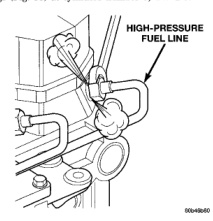

# SERVICE PROCEDURES (Continued)

*Fig. 37 Fuel Supply Line Banjo Bolt*

(4) Tighten banjo bolt at fuel supply line to 24 N·m (18 ft. lbs.) torque. Primary air bleeding is now completed.

(5) Attempt to start engine. If engine will not start, proceed to following steps. If engine does start, it may run erratically and be very noisy for a few minutes. This is a normal condition.

(6) Continue to next step if:

- The vehicle fuel tank has been allowed to run empty
- The fuel injection pump has been replaced
- High-pressure fuel lines have been replaced
- Vehicle has not been operated after an extended period

CAUTION: Do not engage the starter motor for more than 30 seconds at a time. Allow two minutes between cranking intervals.

(7) Perform previous air bleeding procedure steps using fuel transfer pump. Be sure fuel is present at fuel supply line (Fig. 37) before proceeding.

(8) Crank the engine for 30 seconds at a time to allow air trapped in the injection pump to vent out the drain manifold.

WARNING: THE FUEL INJECTION PUMP SUPPLIES EXTREMELY HIGH FUEL PRESSURE TO EACH INDIVIDUAL INJECTOR THROUGH THE HIGH-PRESSURE LINES. FUEL UNDER THIS AMOUNT OF PRESSURE CAN PENETRATE THE SKIN AND CAUSE PERSONAL INJURY. WEAR SAFETY GOGGLES AND ADEQUATE PROTECTIVE CLOTHING AND AVOID CONTACT WITH FUEL SPRAY WHEN BLEEDING HIGH-PRESSURE FUEL LINES.

WARNING: ENGINE MAY START WHILE CRANKING STARTER MOTOR.

Engine may start, may run erratically and be very noisy for a few minutes. This is a normal condition.

(9) Thoroughly clean area around injector fittings where they join injector connector tubes.

(10) Bleed air by loosening high-pressure fuel line fittings (Fig. 38) at cylinders number 3, 4 and 5.

### HIGH-PRESSURE FUEL LINE

*Fig. 38 Bleeding High-Pressure Fuel Lines at Injectors]*

(11) Continue bleeding injectors until engine runs smoothly. It may take a few minutes for engine to run smooth.

(12) Tighten fuel line(s) at injector(s) to 40 N·m (30 ft. lbs.) torque.

### WATER DRAINING AT FUEL FILTER

Refer to Fuel Filter/Water Separator removal/installation for procedures.