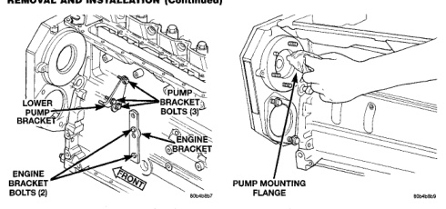
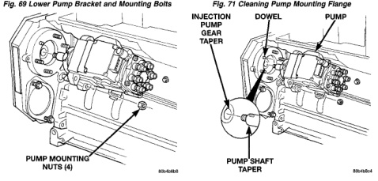

# REMOVAL AND INSTALLATION (Continued)

*Fig. 69 Lower Pump Bracket and Mounting Bolts]*
- LOWER PUMP BRACKET
- PUMP BRACKET BOLTS (3)
- ENGINE BRACKET
- ENGINE BRACKET BOLTS (2)

*Fig. 70 Cleaning Pump Mounting Flange]*
- PUMP MOUNTING FLANGE

[Figure: Fig. 70 Injection Pump Mounting Nuts]
- INJECTION PUMP
- GEAR TAPER
- PUMP MOUNTING NUTS (4)

[Figure: Fig. 72 Injection Pump Installation]
- INJECTION PUMP
- DOWEL
- PUMP GEAR
- PUMP SHAFT TAPER

puller and into two threaded holes supplied in pump gear. Pull injection pump gear forward until it loosens from injection pump shaft. Pull on gear only enough to loosen it from injection pump shaft. Pulling gear too far may cause damage or breakage to gear cover.

(13) Remove 3 lower pump bracket bolts (Fig. 69) and remove lower pump bracket. Loosen, but do not remove 2 engine bracket bolts (Fig. 69).

(14) Remove 4 injection pump-to-gear housing mounting nuts (Fig. 70).

(15) Remove injection pump from gear housing. Take care not to nick injection pump shaft on aluminum gear housing when removing pump. Also be very careful not to drop pump keyway (Fig. 73) into gear housing.

**CAUTION:** Whenever the fuel injection pump is removed from the engine, the pump drive gear is laying loose on the camshaft drive gear. Never attempt to crank or rotate the engine with the pump removed from the engine. Serious damage will occur.

## INSTALLATION

(1) Inspect pump mounting surfaces at pump and mounting flange for nicks, cuts or damage. Inspect o-ring surfaces for nicks, cuts or damage.

(2) Clean injection pump mounting flange (Fig. 71) at gear housing. Also clean front of injection pump.

(3) Install new rubber o-ring (Fig. 73) at pump mounting area.