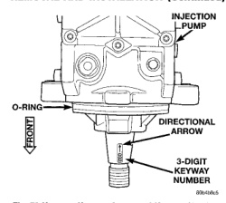
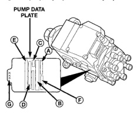

# REMOVAL AND INSTALLATION (Continued)

*Fig. 73 Keyway, Keyway Arrow and Keyway Number]*
- INJECTION PUMP
- O-RING
- DIRECTIONAL ARROW
- 3-DIGIT KEYWAY NUMBER

*Fig. 72 Injection Pump Data Plate Location]*
- PUMP DATA PLATE
- A. ORDER NUMBER
- B. BOSCH PART NUMBER
- C. FACTORY CODE
- D. CUMMINS PART NUMBER
- E. MANUFACTURE DATE
- F. PUMP SERIAL NUMBER
- G. LAST THREE DIGITS OF KEY PART NUMBER

(4) Apply clean engine oil to injection pump o-ring only.

The machined tapers on both injection pump shaft and injection pump gear (Fig. 72) must be absolutely dry, clean and free of any dirt or oil film. This will ensure proper gear-to-shaft tightening.

(5) Clean pump gear and pump shaft at machined tapers (Fig. 72) with an evaporative type cleaner such as brake cleaner.

**Keyway Installation:**

(6) The pump/gear keyway has an arrow and a 3-digit number stamped at top edge (Fig. 73). Position keyway into pump shaft with arrow pointed to rear of pump. Also be sure 3-digit number stamped to top of keyway is same as 3-digit number stamped to injection pump data plate (Fig. 74). If wrong keyway is installed, a diagnostic trouble code may be set.

(7) Position pump assembly to mounting flange on gear cover while aligning injection pump shaft through back of injection pump gear. When installing pump, dowel (Fig. 72) on mounting flange must align to hole in front of pump.

(8) After pump is positioned flat to mounting flange, install four pump mounting nuts and tighten finger tight only. Do not attempt a final tightening at this time. Do not attempt to tighten (pull) pump to gear cover using mounting nuts. Damage to pump or gear cover may occur. The pump must be positioned flat to its mounting flange before attempting to tighten mounting nuts.

(9) To prevent damage or cracking of components, tighten nuts/bolts in the following sequence:

(a) Install injection pump shaft washer and nut to pump shaft. Tighten nut finger tight only.

(b) Position lower pump bracket and install 3 bolts finger tight only.

(c) Do preliminary tightening of injection pump shaft nut to 30 N·m (15-22 ft. lbs.) torque. This is not the final torque.

(d) Tighten 4 pump mounting nuts to 43 N·m (32 ft. lbs.) torque.

(e) Tighten 3 lower pump bracket-to-pump bolts 24 N·m (18 ft. lbs.) torque.

(f) Tighten 2 engine bracket-to-engine bolts 24 N·m (18 ft. lbs.) torque.

(g) Do final tightening of injection pump shaft nut to 170 N·m (125 ft. lbs.) torque. Use barring tool to prevent engine from rotating when tightening gear.

(10) Install plastic access cap (Fig. 65) to front gear cover.

(11) Using new gaskets, install fuel return line and overflow valve to side of injection pump (Fig. 64). Tighten overflow valve to 24 N·m (18 ft. lbs.) torque.

(12) Using new gaskets, install fuel supply line to side of injection pump and top of fuel filter housing (Fig. 64). Tighten banjo bolts to 24 N·m (18 ft. lbs.) torque.

(13) Install all high-pressure fuel lines, intake air tube, accelerator pedal position sensor, air intake housing, engine oil dipstick tube, wiring clips, electrical cables at intake heaters and engine lifting