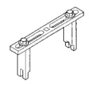
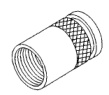
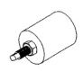
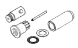
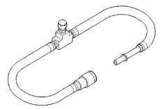

## SPECIFICATIONS (Continued)

### FUEL SYSTEM PRESSURES—DIESEL ENGINES

| DESCRIPTION | PRESSURE |
|-------------|----------|
| Fuel Transfer (Lift) Pump Pressure With Engine Running | minimum 69 kPa (10 psi) |
| Fuel Transfer (Lift) Pump Pressure With Engine Cranking | minimum 48 kPa (7 psi) |
| Fuel Injector "Pop Off" Pressure | 31,026 kPa (310 bars) or (4500 psi ± 250 psi) |
| Fuel Injector Leak-Down Pressure | approximately 20 bars (291 psi) lower than pop pressure |
| Fuel Pressure Drop Across Fuel Filter Test Ports | 34 kPa max. (5 psi max.) at 2500 rpm (rated rpm) |
| Overflow Valve Release Pressure | 97 kPa max. (14 psi) at 2500 rpm (rated rpm) |

*Fig. 2 Fuel Injector Pop Pressure Adapter—8301*

## SPECIAL TOOLS

### DIESEL FUEL SYSTEM

*Fig. 3 Spanner Wrench (Fuel Tank Module Removal/Installation)—6856*

*Fig. 4 Fuel Injector Remover—8318*

*Fig. 5 Engine Barring (Rotating) Tool—7471B or 7471C (part of kit 6714)*

*Fig. 6 Fuel Injector Tube (Connector) Remover—8324*

[Figure: Fuel Pressure Hose Adapters—6631 and/or 6539]