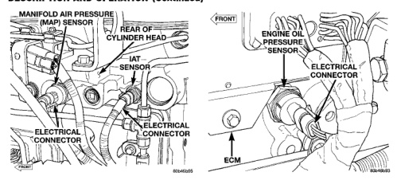

# DESCRIPTION AND OPERATION (Continued)

*Fig. 11 Intake Manifold Air Temperature (IAT) Sensor Location]*
- MANIFOLD AIR PRESSURE (MAP) SENSOR
- REAR OF CYLINDER HEAD
- IAT SENSOR
- ELECTRICAL CONNECTOR

## MANIFOLD AIR PRESSURE (MAP) SENSOR—ECM INPUT

The MAP sensor reacts to air pressure changes in the intake manifold. It provides an input voltage to the Engine Control Module (ECM). As pressure changes, MAP sensor voltage will change. The change in MAP sensor voltage results in a different input voltage to the ECM. The ECM uses this input, along with inputs from other sensors to provide fuel timing, fuel control and engine protection. Engine protection is used to derate (drop power off) the engine if turbocharger pressure becomes too high.

The MAP sensor is installed into the rear of the intake manifold (Fig. 11).

## OIL PRESSURE SENSOR (ENGINE)—ECM INPUT

A signal is sent from the engine oil pressure sensor (sending unit) to the Engine Control Module (ECM) relating to engine oil pressure. The ECM monitors this signal and converts it to a pressure value. This value is used by the ECM for the engine protection system.

The pressure signal from the ECM is bussed to the instrument panel oil gauge/lamp via the CCD circuits.

The oil pressure sensor is installed into the oil pressure galley on the engine block. It is located below and to the rear of the ECM (Fig. 12).

[Figure: Fig. 12 Oil Pressure Sensor (Engine) Location]
- FRONT
- ENGINE OIL PRESSURE SENSOR
- ELECTRICAL CONNECTOR
- ECM

## PTO SWITCH SENSE—ECM INPUT

This Engine Control Module (ECM) input is used only on models equipped with aftermarket Power Take Off (PTO) units.

The input is used to tell the ECM that the PTO has been engaged. When engaged, the ECM will disable certain OBD II functions until the PTO has been turned off.

## WATER-IN-FUEL (WIF) SENSOR—ECM INPUT

The sensor sends an input to the Engine Control Module (ECM) when it senses water in the fuel filter/water separator. As the water level in the filter/separator increases, the resistance across the WIF sensor decreases. This decrease in resistance is sent as a signal to the ECM and compared to a high water standard value. Once the value reaches 30 to 40 kilohms, the ECM will activate the water-in-fuel warning lamp through CCD bus circuits. This all takes place when the ignition key is initially put in the ON position. The ECM continues to monitor the input at the end of the intake manifold air heater post-heat cycle.

The WIF sensor is located at the bottom of the fuel filter/water separator canister (Fig. 13).

## FUEL INJECTION PUMP RELAY—ECM OUTPUT

The Engine Control Module (ECM) energizes the electric fuel injection pump through the fuel injection pump relay. Battery voltage is applied to the fuel injection pump relay at all times. When the key is turned ON, the relay is energized when a 12-volt signal is provided by the ECM. When energized, 12-volts is supplied to the Fuel Pump Control Module. The Fuel Pump Control Module is located on the top of the fuel injection pump and is non-serviceable.

The fuel injection pump relay is located in the Power Distribution Center (PDC). Refer to label under PDC cover for relay location.