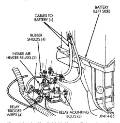

# DESCRIPTION AND OPERATION (Continued)

*Fig. 13 Water-in-Fuel Sensor Location*
- FUEL FILTER/WATER SEPARATOR
- FUEL HEATER
- FUEL INLET
- WATER-IN-FUEL (WIF) SENSOR
- TEST PORT FITTINGS
- FUEL OUTLET

*Fig. 15 Air Heater Elements Location]*
- UPPER GASKET
- AIR HEATER ELEMENTS
- BLOCK
- LOWER GASKET

## INTAKE MANIFOLD AIR HEATER ELEMENTS

The air heater elements are used to heat incoming air to the intake manifold. This is done to help engine starting and improve driveability with cool or cold outside temperatures.

Electrical supply for the 2 air heater elements is controlled by the Engine Control Module (ECM) through the 2 air heater relays. Refer to Intake Manifold Air Heater Relays for more information.

Two heavy-duty cables connect the 2 air heater elements to the 2 air heater relays. Each of these cables will supply approximately 95 amps at 12 volts to an individual heating element within the heater block assembly.

The intake manifold air heater element assembly is located in the top of the intake manifold (Fig. 14). Refer to the Powertrain Diagnostic Procedures manual for an electrical operation and complete description of the intake heaters, including pre-heat and post-heat cycles.

## INTAKE MANIFOLD AIR HEATER RELAYS—ECM OUTPUT

The Engine Control Module (ECM) operates the 2 heating elements through the 2 intake manifold air heater relays.

The 2 relays are located in the engine compartment, attached to the left inner fender below the left battery (Fig. 15).

Refer to the Powertrain Diagnostic Procedures manual for an electrical operation and complete description of the intake heaters, including pre-heat and post-heat cycles.

[Figure: Fig. 15 Intake Manifold Air Heater Relays Location]
- BATTERY (LEFT SIDE)
- CABLES TO BATTERY (+)
- RUBBER SHIELD (2)
- INTAKE AIR HEATER RELAYS (2)
- RELAY WIRES (4)
- RELAY WIRES (4)
- RELAY WIRES (4)

## WAIT-TO-START WARNING LAMP—ECM OUTPUT

The wait-to-start warning lamp is turned on and off by the Engine Control Module (ECM) based on the intake manifold air temperature sensor input.

The lamp is located on the instrument panel.

The lamp is turned on when the key is first activated. If the ECM reads intake manifold air temperature below 19°C (66°F), it will turn the wait-to-start warning lamp on for the air heater pre-heat cycle. The lamp stays on until the pre-heat cycle is over.