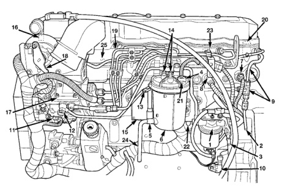

*Fig. 1*

### DESCRIPTION AND OPERATION (Continued)

1. FUEL TRANSFER (LIFT) PUMP 2. FUEL RETURN LINE (TO FUEL TANK)

3. FUEL SUPPLY LINE (LOW-PRESSURE, TO ENGINE)

4. FUEL HEATER

5. WATER-IN-FUEL (WIF) SENSOR 6. FUEL FILTER/WATER SEPARATOR

7. IAT SENSOR 8. MAP (BOOST) SENSOR 9. FUEL DRAIN MANIFOLD

10. CKP SENSOR

11. CMP SENSOR

12. OVERFLOW VALVE

13. DRAIN VALVE

14. FUEL PRESSURE TEST PORTS

15. ECM

16. ECT SENSOR

17. FUEL INJECTION PUMP 18. THROTTLE LEVER BELLCRANK AND APPS 19. HIGH-PRESSURE FUEL LINES

19. HIGH-PRESSURE FUEL LINES 20. FUEL INJECTORS

21. FUEL HEATER TEMPERATURE SENSOR (THERMOSTAT) 22. OIL PRESSURE SENSOR 23. FUEL INJECTOR CONNECTOR 24. DRAIN TUBE 25. INTAKE MANIFOLD AIR HEATER/ELEMENTS
