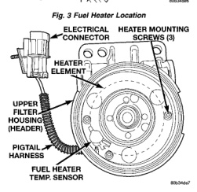
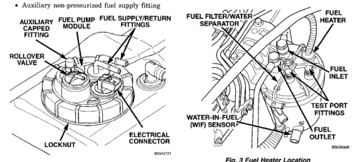

An electric fuel pump is not used in the fuel tank module for diesel powered engines. Fuel is supplied by the engine mounted fuel transfer pump and the fuel injection pump. The fuel tank module is installed in the top of the fuel tank (Fig. 2). The fuel tank module (Fig. 2) contains the following components: · Fuel reservoir

• · A separate in-tank fuel filter · Rollover valve

• · Fuel gauge sending unit (fuel level sensor) · Fuel supply line connection · Fuel return line connection · Auxiliary non-pressurized fuel supply fitting

The fuel gauge sending unit (fuel level sensor) is attached to the side of the fuel tank module. The sending unit consists of a float, an arm, and a variable resistor (track). The resistor track is used to send electrical signals to the Powertrain Control Module (PCM) for fuel gauge operation. After this signal is sent to the PCM, the PCM will transmit the data across the CCD bus circuits to the instrument. panel. Here it is translated into the appropriate fuel gauge level reading. As fuel level increases, the float and arm move up. This decreases the sending unit resistance, causing the fuel gauge to read full. As fuel level decreases, the float and arm move down. This increases the sending unit resistance causing the fuel gauge to read emptv.

The fuel heater is used to prevent diesel fuel from waxing during cold weather operation. The fuel heater assembly is located in the top of the fuel filter housing (Fig. 3). The heater/element assembly is equipped with a temperature sensor (thermostat) that senses fuel temperature. This sensor is attached to the fuel heater/element assembly (Fig. 4) (bottom view). When the temperature is below 45 ±8 degrees F. the sensor allows current to flow to the heater element warming the fuel. When the temperature_is-above -75 ->8 degrees F, the sensor stops current flow to the heater element.

*Fig. 3 Fuel Heater Location*

*Fig. 4 Fuel Heater Temperature Sensor Location*

*Fig. 2*
