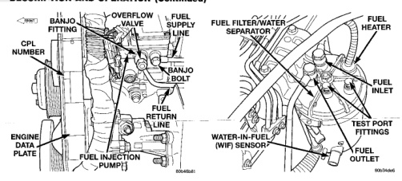

*Fig. 8*

The fuel volume of the transfer pump will always provide more fuel than the fuel injection pump requires. Excess fuel is returned from the injection pump through an overflow valve. The valve is located on the side of the injection pump (Fig. 8). It is also used to connect the fuel return line to the side of the injection pump. This valve opens at approximately 97 kPa (14 psi) and returns fuel to the fuel tank through the fuel return line.

The fuel tank is similar to the tank used with gasoline powered models. The tank is equipped with a separate fuel return line and a different fuel tank module for diesel powered models. A fuel tank mounted, electric fuel pump is not used with diesel powered models. Refer to Fuel Tank Module for additional information.

Refer to Group 25. Emission Control System for information.

The fuel filter/water separator protects the fuel injection pump by removing water and contaminants from the fuel. The construction of the filter/separator allows fuel to pass through it, but helps prevent moisture (water) from doing so. Moisture collects at the bottom of the canister.

The fuel filter/water separator assembly is located on left side of engine above starter motor (Fig. 9). The assembly also includes the fuel heater and Water-In-Fuel (WIF) sensor. Refer to the maintenance schedules in Group 0 in this manual for the recommended fuel filter replacement intervals. For draining of water from canister, refer to Fuel Filter/Water Separator Removal/Installation section. A Water-In-Fuel (WIF) sensor is attached to side of canister. Refer to Water-In-Fuel Sensor Description/ Operation. The fuel heater is installed into the top of the filter/separator housing. Refer to Fuel Heater Description/Operation.

WARNING: HIGH-PRESSURE FUEL LINES DELIVER DIESEL FUEL UNDER EXTREME PRES- SURE FROM THE INJECTION PUMP TO THE FUEL INJECTORS. THIS MAY BE AS HIGH AS 120,000 KPA (17,405 PSI) . USE EXTREME CAUTION WHEN INSPECTING FOR HIGH-PRESSURE FUEL LEAKS. INSPECT FOR HIGH-PRESSURE FUEL LEAKS WITH A SHEET OF CARDBOARD. HIGH FUEL INJECTION PRESSURE CAN CAUSE PERSONAL INJURY IF CONTACT IS MADE WITH THE SKIN.
