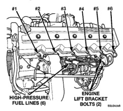
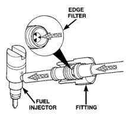

*Fig. 14*

Each fuel injector connector tube contains an edge filter (Fig. 15) that breaks up small contaminants that enter the injector. The edge filter uses the injectors pulsating high-pressure to break up most particles so thev are small enough to pass through the injector. The edge filters are not a substitute for proper cleaning and covering of all fuel system components during repair. The bottom of each fuel injector is sealed to the cylinder head with a 1.5mm thick copper shim (gasket) (Fig. 14). The correct thickness shim must always be re-installed after removing an injector. Fuel pressure in the injector circuit decreases after injection. The injector needle valve is immediately closed by the needle valve spring and fuel flow into the combustion chamber is stopped. Exhaust gases are prevented from entering the injector nozzle by the needle valve.

Different types/sizes of quick-connect fittings are used to attach various fuel system components. These may be: a single-tab type, a two-tab type or a plastic retainer ring-type. Most fittings on diesel applications are the two-tab type. Refer to Quick- Connect Fittings Removal/Installation for more information.

CAUTION: The interior components (o-rings, spacers) of quick-connect fittings are not serviced separately, but new clips are available for some types. Do not attempt to repair damaged fittings or fuel lines/tubes. If repair is necessary, replace the complete fuel tube assembly.

All fuel lines up to the fuel injection pump are considered low-pressure. This includes the fuel lines from: the fuel tank to the fuel transfer pump, and the fuel transfer pump to the fuel injection pump. The fuel return lines, the fuel drain manifold and the fuel drain manifold lines are also considered low-pressure lines. High-pressure lines are used between the fuel injection pump and the fuel injectors. Also refer to High-Pressure Fuel Lines Description/Operation.

The high-pressure fuel lines are the 6 lines located between the fuel injection pump and the fuel injector connector tubes (Fig. 16). All other fuel lines are considered low-pressure lines.

*Fig. 15*

CAUTION: The high-pressure fuel lines must be held securely in place in their holders. The lines cannot contact each other or other components. Do not attempt to weld high-pressure fuel lines or to repair lines that are damaged. If lines are ever kinked or bent, they must be replaced. Use only the recommended lines when replacement of high-pressure fuel line is necessary.

High-pressure fuel lines deliver fuel under pressure of up to approximately 120,000 kPa (17,405 PSI) from the injection pump to the fuel injectors. The lines expand and contract from the high-pressure fuel pulses generated during the injection process. All high-pressure fuel lines are of the same length and inside diameter. Correct high-pressure fuel line usage and installation is critical to smooth engine operation.
